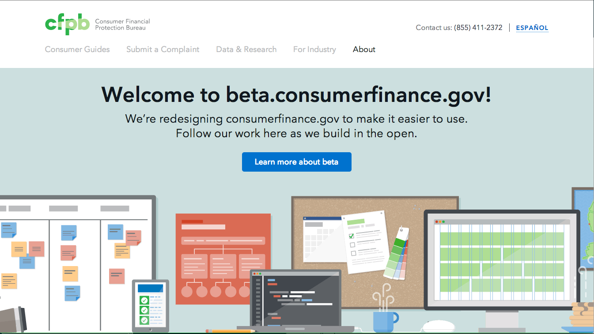

# cfgov-refresh

[](https://travis-ci.org/cfpb/cfgov-refresh?branch=flapjack)
[](https://codeclimate.com/github/cfpb/cfgov-refresh?branch=flapjack)

The in-progress redesign of the [consumerfinance.gov](http://consumerfinance.gov) website.
This Django project includes the front-end assets and build tools,
[Jinja templates](http://jinja.pocoo.org) for front-end rendering,
and [Sheer-Like](https://github.com/cfpb/django-sheerlike) configurations for loading content from the
WordPress and back-ends through Elasticsearch.

**Technology stack**:
- Mac OSX.
- [Homebrew](http://brew.sh) - package manager for installing system
  software on Mac OSX.
- Python and PIP (Python package installer).
- WordPress API data source URL.

**This project is a work in progress.**
Nothing presented in this repo—whether in the source code, issue tracker,
or wiki—is a final product unless it is marked as such or appears on consumerfinance.gov.



## Dependencies
- [Sheer](https://github.com/cfpb/sheer):
  Web server used to serve the pages using [Jinja templates](http://jinja.pocoo.org).
  Sheer is a Jekyll-inspired, Elasticsearch-powered, CMS-less publishing tool.
- [Elasticsearch](http://www.elasticsearch.org):
  Used for full-text search capabilities and content indexing.
- [Node](http://nodejs.org) and npm (Node Package Manager):
  Used for downloading and managing front-end dependencies and assets.

## Installation

Using the console, navigate to your project directory (`cd ~/Projects` or equivalent).
Clone this project’s repository and switch to its directory with:

```bash
git clone git@github.com:cfpb/cfgov-refresh.git
cd cfgov-refresh
```

Then follow the instructions in [INSTALL](INSTALL.md).

## Configuration

For necessary server-side configurations, follow instructions in
[INSTALL - Configuration](INSTALL.md#configuration).

## Usage

Generally you will have four tabs (or windows) open in your terminal when using this project.
These will be used for:
 1. **Git operations**.
    Perform Git operations and general development in the repository.
 2. **Elasticsearch**.
    Run an Elasticsearch instance.
    **Sheer Index**
    Load indexes into ES.
 3. **Start django server**.
    Start Django Server
 4. **Gulp watch**.
    Run the Gulp watch task for watching for changes to content.

What follows are the specific steps for each of these tabs.

### 1. Git operations

From this tab you can do Git operations,
such as checking out our development branches:

```bash
git checkout flapjack # Branch for our staging-development server.
git checkout refresh  # Branch for our staging-stable server.
```

#### Updating all dependencies

Each time you fetch from the upstream repository (this repo), run `./setup.sh`.
This setup script will remove and re-install the project dependencies
and rebuild the site's JavaScript and CSS assets.


### 2. Run Elasticsearch

> Note: This Elasticsearch tab (or window) might not be necessary if you opted for the `launchd`
option when [installing Elasticsearch](INSTALL.md#elasticsearch).

To launch Elasticsearch, first find out where your Elasticsearch config file is located.
You can do this with [Homebrew](http://brew.sh) using:

```bash
brew info elasticsearch
```

The last line of that output should be the command you need to launch Elasticsearch with the
proper path to its configuration file. For example, it may look like:

```bash
elasticsearch --config=/Users/[YOUR MAC OSX USERNAME]/homebrew/opt/elasticsearch/config/elasticsearch.yml
```

### 3. Load Indexes & Launch Site
To do this, run the following:

```bash
# Use the cfgov-refresh virtualenv.
workon cfgov-refresh

# cd into the /cfgov/v1/jinja2/v1/ directory.
cd cfgov/v1/jinja2/v1

# Index the latest content from the API output from a WordPress and Django back-end.
# **This requires the constants in INSTALL - Configuration to be set**
sheer index

# From the Project root, start server.
./runserver.sh

# **Note**
# If prompted to migrate database changes, stop the server ctrl+c and run these commands
python cfgov/manage.py migrate
./runserver.sh
```

To view the site browse to: <http://localhost:8000>

To view the project layout docs and pattern library,
browse to <http://localhost:8000/docs>

To view the indexed content you can use a tool called
[elasticsearch-head](http://mobz.github.io/elasticsearch-head/).

**Using a different port:** If you want to run the server at a different port
than 8000 use `python cfgov/manage.py runserver <port number>`, e.g. `8001`.

### 4. Launch the Gulp watch task

To watch for changes in the source code and automatically update the running site,
open a terminal and run:

``` bash
gulp build
gulp watch
```

**NOTE:** The watch task only runs for the tasks for files that have changed.
Also, you must run `gulp build` at least once before watching.

#### Available Gulp Tasks
In addition to `gulp watch`, there are a number of other important gulp tasks,
particularly `gulp build` and `gulp test`,
which will build the project and test it, respectively.
Using the `gulp --tasks` command you can view all available tasks.
The important ones are listed below:

```
gulp build           # Concatenate, optimize, and copy source files to the production /dist/ directory.
gulp clean           # Remove the contents of the production /dist/ directory.
gulp lint            # Lint the scripts and build files.
gulp test            # Run linting, unit and acceptance tests (see below).
gulp test:unit       # Run only unit tests on source code.
gulp test:acceptance # Run only acceptance (in-browser) tests on production code.
gulp watch           # Watch for changes in the source and launch and auto-update a browser instance.
```

## How to test the software

Follow the instructions in [TEST](TEST.md).

## Getting help

Use the [issue tracker](https://github.com/cfpb/cfgov-refresh/issues) to follow the
development conversation.
If you find a bug not listed in the issue tracker,
please [file a bug report](https://github.com/cfpb/cfgov-refresh/issues/new?body=
%23%23%20URL%0D%0D%0D%23%23%20Actual%20Behavior%0D%0D%0D%23%23%20Expected%20Behavior
%0D%0D%0D%23%23%20Steps%20to%20Reproduce%0D%0D%0D%23%23%20Screenshot&labels=bug).

## Getting involved

We welcome your feedback and contributions.
See the [contribution guidelines](CONTRIBUTING.md) for more details.

Additionally, you may want to consider
[contributing to the Capital Framework](https://cfpb.github.io/capital-framework/contributing/),
which is the front-end pattern library used in this project.

## Working with the templates
<!-- Perhaps we want to split this out into a separate page? -->
### Front-End Template/Asset Locations ###

**Templates** that are served by the django server: ```cfgov\v1\jinja2\v1 ```

**Static assets** prior to processing (minifying etc.): ```cfgov\v1\preprocessed```. *note after a gulp build they are copied over to the ```cfgov\v1\static``` location ready to be served by django.*

### Simple static template setup

By default, Django will render pages with accordance to the url pattern defined
for it. For example, going to <http://localhost:8000/the-bureau/index.html>
(or <http://localhost:8000/the-bureau/>) renders `/the-bureau/index.html` from
the `v1` app folder's jinja2 templates folder as processed by the [Jinja2](http://jinja.pocoo.org/docs)
templating engine.

### Outputting indexed content in a Sheer template

Most of our content is indexed from the API output of our WordPress back-end.
This happens when the `sheer index` command is run.

There are two ways in which we use indexed content:
repeating items (e.g., blog posts and press releases),
and single pages (e.g., the Future Requests page in Doing Business with Us).
What follows is a deeper dive into both of these content types.

#### Repeating content

For any kind of repeating content, this is the basic process:

1. In the vars file for the section you're in (e.g., `blog/_vars-blog.html`),
  we set up a variable that holds the results of the default query we want to run.

  Here's how it looks for the blog:

  ```jinja
  
  
  ```

2. If you want to display the repeating content within a template,
  simply set up a `for ... in` loop,
  then output the different properties of the post within.
  In the case of the blog, a list of posts is built using this method in
  `_includes/posts-paginated.html`.

  Here is a simplified example:

  ```jinja
  
    <h1>{{ post.title }}</h1>
    {{ post.content }}
  
  ```

3. If you would like to display each instance of repeating content in a separate
  page, create a `_single.html` template (in the case of the blog,
  located at `blog/_single.html`) and a corresponding entry in `_settings/lookups.json`.
  Sheer will automatically create URLs for every post of that type and render
  them with the `_single.html` template.
  This is how separate pages are generated for each blog post.

#### Single content

To access a single piece of content,
the easiest thing to do is use the `get_document()` function.

Using the example given earlier of the Future Requests page,
here's how it's done:

```jinja

{{ page.content | safe }}
```

The `get_document` method can be used to retrieve a single item of any post type
for display within a template.
In the below example from `contact-us/promoted-contacts.html`,
we get an instance of the non-hierarchical `contact` post type using its slug (`whistleblowers`):

```jinja

```

In practice, many of our templates are a Frankenstein-type mixture
of hand-coded static content and calls to indexed content,
as we continually try to strike the right balance of what content
is appropriate to be edited by non-developers in WordPress,
and what is just too fragile to do any other way than by hand.

### Filtering results with queries

Sometimes you'll want to create queries in your templates to filter the data.

The two main ways of injecting filters into your data are in the URL's query
string and within the template code itself.

We have a handy function `search()` that:

1. Pulls in filters from the URL query string.
2. Allows you to add additional filters by passing them in as arguments to the function.

#### URL query string filters

URL query string filters can be further broken down into two types:

1. Term - Used when you want to filter by whether a field matches a term.  Note that in order
to use this type of filter, the field you are matching it against must have `"index": "not_analyzed"`
set in the mapping.
2. Range - Used for when you want to filter something by a range (e.g. dates or numbers)

An example of Term is:

`?filter_category=Op-Ed`

`filter_[field]=[value]`

When you go to a URL such as http://localhost:8000/blog/?filter_category=Op-Ed
and you use `search()`,
the queryset returned will only include objects with a category of 'Op-Ed'.

An example of Range is:

`?filter_range_date_gte=2014-01`

`filter_range_[field]_[operator]=[value]`

Continuing with the example above, if you go to a URL such as
`http://localhost:8000/blog/?filter_range_date_gte=2014-01`
and you use `search()`,
you'll get a queryset of objects where the 'date' field is in January, 2014, or later.

URL query string filters are convenient for many of the filtered queries you'll need to run,
but often there are cases where you'll need more flexibility.

#### More complex filters

By default, `search()` uses the default query parameters
defined in the `_queries/object-name.json` file,
then mixes them in with any additional arguments
from the URL query string in addition to what is passed into the function itself.

When using `search()`, you can also pass in filters with the same `filter_` syntax as above.

For example:

`search(filter_category='Op-Ed')`

Multiple term filters on the same field will be combined in an OR clause, while
term filters of different fields will be combined in an AND clause.

For example:

`search(filter_tag='Students', filter_tag='Finance', filter_author='Batman')`

This will return documents that have the tag Students OR Finance, AND have an author of Batman.

If you need more control over your filter than that, enter it manually in the _queries/filtername.json file.

----

## Open source licensing info
1. [TERMS](TERMS.md)
2. [LICENSE](LICENSE)
3. [CFPB Source Code Policy](https://github.com/cfpb/source-code-policy/)


----

## Credits and references

As mentioned in this Readme,
the project uses the [Capital Framework](https://github.com/cfpb/capital-framework)
for its user interface and layout components.
