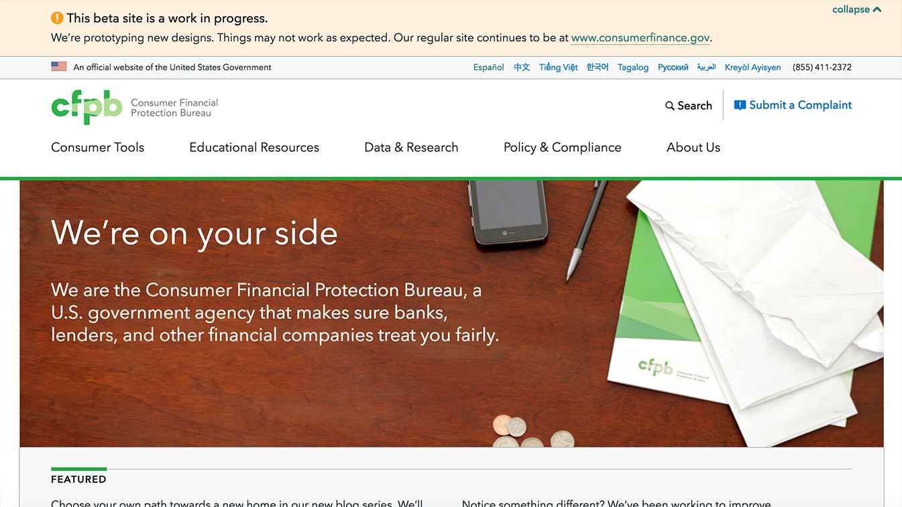

# cfgov-refresh

[](https://travis-ci.org/cfpb/cfgov-refresh?branch=flapjack)
[](https://codeclimate.com/github/cfpb/cfgov-refresh?branch=flapjack)

The redesign of the [www.consumerfinance.gov](http://www.consumerfinance.gov) website.
This Django project includes the front-end assets and build tools,
[Jinja templates](http://jinja.pocoo.org) for front-end rendering,
and [Wagtail CMS](https://wagtail.io) for content administration.



The instructions for using this project are contained in the `docs` subfolder of this repository. You should get started by checking out the repository by doing
```
git clone git@github.com:cfpb/cfgov-refresh.git
```
in whatever directory you keep your projects. This will create a `cfgov-refresh` directory there. Create a `virtualenv` in that directory via
```
cd cfgov-refresh
virtualenv .
```
All development on `cfgov-refresh` must take place inside a virtual environment. If you are missing `virtualenv` install it via `pip`:
```
pip install virtualenv
```

Switch to the `virtualenv` by running
```
source ./bin/activate
```
Note that there are several `activate` files in `bin`, so you'll need to run the one that is appropriate for your shell. This document assumes that you are using `bash` but if you are using e.g. `fish`, you'll need to run `. /bin/activate.fish`. If you have `virtualenvwrapper` installed, you should be able to switch via `workon cfgov-refresh`.

Once you have done that, to read the online documentation in a convenient format, you will need to install the `mkdocs` package via `pip`:
```
pip install mkdocs
```
`mkdocs` comes with a convenient server that will serve the docs for you locally. To run it, do
```
cd docs
mkdocs serve [-a host:port]
```
The `-a` argument is optional; if you leave it off, `mkdocs` will serve the manual on `localhost:8000` and you can then navigate there in the browser and read the documentation.

Once the manual is up and running, you should continue by reading the installation and usage sections to understand how to get the full project up and running.

Alternatively, if for whatever reason you don't want to browse the documentation locally, you can find the manual on the `gh-pages` branch of `cfgov-refresh`. It can be accessed at [http://cfpb.github.io/cfgov-refresh/](http://cfpb.github.io/cfgov-refresh/).

## Getting help

Use the [issue tracker](https://github.com/cfpb/cfgov-refresh/issues) to follow the
development conversation.
If you find a bug not listed in the issue tracker,
please [file a bug report](https://github.com/cfpb/cfgov-refresh/issues/new?body=
%23%23%20URL%0D%0D%0D%23%23%20Actual%20Behavior%0D%0D%0D%23%23%20Expected%20Behavior
%0D%0D%0D%23%23%20Steps%20to%20Reproduce%0D%0D%0D%23%23%20Screenshot&labels=bug).

## Getting involved

We welcome your feedback and contributions.
See the contribution guidelines in the manual for more details.

Additionally, you may want to consider
[contributing to the Capital Framework](https://cfpb.github.io/capital-framework/contributing/),
which is the front-end pattern library used in this project.

----

## Open source licensing info
1. [TERMS](TERMS.md)
2. [LICENSE](LICENSE)
3. [CFPB Source Code Policy](https://github.com/cfpb/source-code-policy/)


----

## Credits and references

This project uses the [Capital Framework](https://github.com/cfpb/capital-framework)
for its user interface and layout components.
