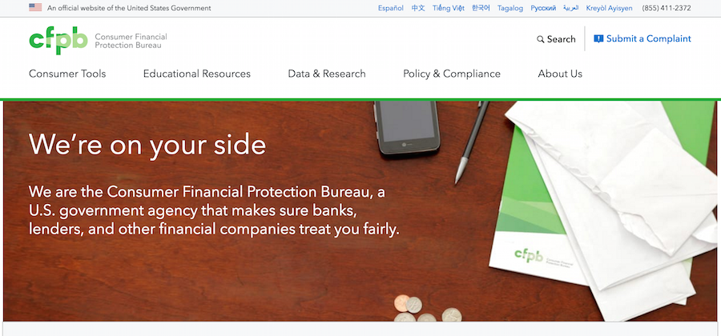

# cfgov

[](https://travis-ci.org/cfpb/cfgov-refresh?branch=master)
[](https://codecov.io/gh/cfpb/cfgov-refresh)

The redesign of the [www.consumerfinance.gov](http://www.consumerfinance.gov) website.
This Django project includes the front-end assets and build tools,
[Jinja templates](http://jinja.pocoo.org) for front-end rendering,
and [Wagtail CMS](https://wagtail.io) for content administration.




## Quickstart

Full [installation](https://cfpb.github.io/cfgov-refresh/installation/)
and [usage](https://cfpb.github.io/cfgov-refresh/usage/) instructions,
including those for an alternative Docker-based local setup,
are available in [our documentation](https://cfpb.github.io/cfgov-refresh).

This project requires Python 2.7, Node 8, and Gulp 4. We recommend the use of [virtualenv](https://virtualenv.pypa.io/en/stable/) and [virtualenvwrapper](https://virtualenvwrapper.readthedocs.io/en/latest/).

Clone the repository:

```sh
git clone git@github.com:cfpb/cfgov-refresh.git
```

Create a virtual environment for Python dependencies:

```sh
cd cfgov-refresh
mkvirtualenv --python=python2.7 cfgov-refresh
```

Create and load initial environment settings:

```
cp -a .env_SAMPLE .env
source .env
```

Install third-party dependencies and build frontend assets:

```sh
./setup.sh
```

Create a local database and add some basic pages:

```sh
./initial-data.sh
```

Start your local Django server:

```sh
./runserver.sh
```

Your site will be available locally at <http://localhost:8000>.

The site admin will be available at <http://localhost:8000/admin/>, using login `admin` /
`admin`.


## Documentation

Full documentation for this project is available in the [docs](docs/) directory
and [online](https://cfpb.github.io/cfgov-refresh/).

If you would like to browse the documentation locally, you can do so
with [`mkdocs`](http://www.mkdocs.org/):

```sh
pip install -r requirements/docs.txt
mkdocs serve
```

Documentation will be available locally at [http://localhost:8000](http://localhost:8000).


## Getting help

Use the [issue tracker](https://github.com/cfpb/cfgov-refresh/issues) to follow the
development conversation.
If you find a bug not listed in the issue tracker,
please [file a bug report](https://github.com/cfpb/cfgov-refresh/issues/new).


## Getting involved

We welcome your feedback and contributions.
See the [contribution guidelines](CONTRIBUTING.md) for more details.

Additionally, you may want to consider
[contributing to the Capital Framework](https://cfpb.github.io/capital-framework/contributing/),
which is the front-end pattern library used in this project.


## Open source licensing info
1. [TERMS](TERMS.md)
2. [LICENSE](LICENSE)
3. [CFPB Source Code Policy](https://github.com/cfpb/source-code-policy/)


## Credits and references

This project uses the [Capital Framework](https://github.com/cfpb/capital-framework)
for its user interface and layout components.
