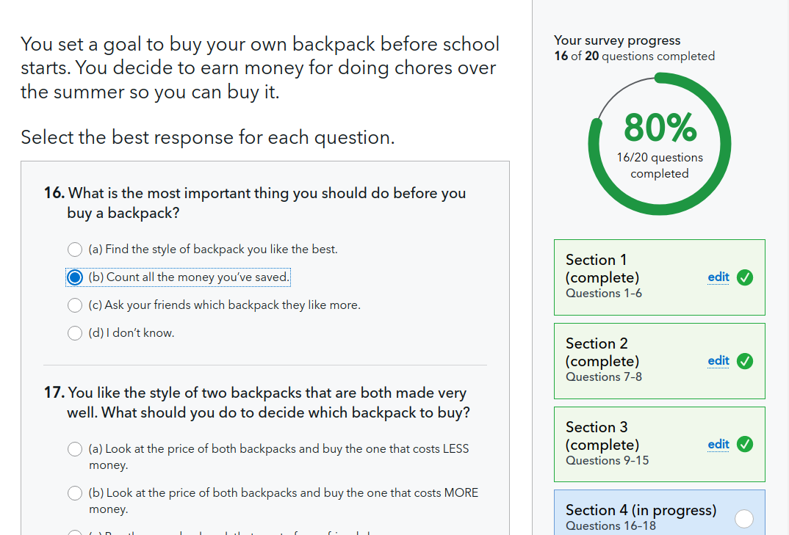

# TDP Survey System

## Overall design and technical stack

[Three web-based surveys](https://www.consumerfinance.gov/consumer-tools/educator-tools/youth-financial-education/assess/survey/) are implemented via dynamically-created Django forms and custom JavaScript. The [django-formtools library](https://django-formtools.readthedocs.io/en/latest/wizard.html) is used to allow each of the forms to be broken across multiple pages. While taking a survey, users can return to previous pages and all their responses are stored in their browser for the length of the session.



Each survey is created within the server as a Survey object ([surveys.py](surveys.py)) which is populated with all the survey’s questions, answers, and the score value of each answer. Upon server startup, each Survey object is created--by reading comma-separated values files (Survey.factory, [example questions](survey-data/3-5.csv) and [answer sets](survey-data/answer-types.csv))--and it supplies the view system with custom Django form classes for each logical page of questions. A SurveyWizard class ([views.py](views.py)) binds all the survey’s form pages into a single logical form that operates like a Django TemplateView.

We also use a custom SurveyForm ([forms.py](forms.py)) subclass of Django Form allowing needed customization of the label markup.

When a survey is completed (SurveyWizard.done), the response data is used to get a set of scores for each question in the survey.

### Results Page

When a user completes a survey, the scores for its three parts are obscured and packed into a text code and this code is temporarily stored in a session browser cookie. This allows the Results page to display custom content based on the user’s scores (and without students ending up with scoring URLs in their browsing history). The code is also cryptographically signed via [Django’s Signer class](https://docs.djangoproject.com/en/2.2/topics/signing/) so that students cannot tamper with it to change their scores.

The Results page (student_results in views.py) is built with content based on the part scores using a Jinja2 template and data in a ResultsContent object. ResultsContent is populated from [CSV data](survey-data/results-content.csv) that determines how to place scores within six different segments.

### Sharing

When the user wants to share results ([survey/result-page.js](../unprocessed/apps/teachers-digital-platform/js/survey/result-page.js)), the page similarly obscures the user’s initials into a code format and the two codes are embedded into a “shared URL” (example [shared page](https://www.consumerfinance.gov/consumer-tools/educator-tools/youth-financial-education/survey/3-5/view/?r=v1_3-5_u%3At%3Ah_5cgch%3AVn7SFasXLXUwxrNbkTHJEP34qMo#MWUuMWo0NDIuZndhZg==)).

Note: The data holding the user’s PII is only placed in the hash portion of the URL so that it’s never sent to the CFPB server nor to Google Analytics servers.

Both the student scores code and the shared URL code are identical and validated by the Django form class SharedUrlForm ([forms.py](forms.py)), with the code either coming from the querystring (shared URLs) or a cookie (student results).

When the teacher accesses a shared URL, the user’s initials are decoded from the URL’s hash portion ([survey/initials.js](../unprocessed/apps/teachers-digital-platform/js/survey/initials.js)) and the original Results page is constructed with minimal differences.

### Survey Features

If a user reloads the page or returns to a previous page before submitting the form, their answers are repopulated in the page. This is done by storing all selections in the browser’s sessionStorage API immediately upon making them ([survey/ChoiceField.js](../unprocessed/apps/teachers-digital-platform/js/survey/ChoiceField.js)).

As each question is answered, a ProgressBar component ([survey/ProgressBar.js](../unprocessed/apps/teachers-digital-platform/js/survey/ProgressBar.js)) tracks overall progress and provides events to draw a circular meter.

Although a user can jump multiple pages backwards via “edit” links, technical limitations require always moving forward via the “Next” submit buttons at the bottom of the screen.

If a page is submitted without all questions answered, the user is shown an error message with links to scroll back to all unanswered questions.

Progress through pages is tracked on a set of section buttons ([survey/SectionLink.js](../unprocessed/apps/teachers-digital-platform/js/survey/SectionLink.js)) that have various features based on the current state:

1. The current section is blue.
2. Previous sections are green and can be navigated to.
3. Completed sections ahead of the user are white.
4. Unvisited sections are gray.
5. All completed sections have a green check mark.

### Student Results Features

Below the results, students are given options to print and/or share their results page (survey/result-page.js). Both buttons launch modal dialogs and ask for the user’s initials, which are encoded into the shared URL ([survey/initials.js](../unprocessed/apps/teachers-digital-platform/js/survey/initials.js)). The student need only enter them once.

Once the Results page is displayed, the user’s original selections are cleared and the user cannot return to the survey.

### Modal Dialogs

Several features are presented inside modal dialogs ([modals.js](../unprocessed/apps/teachers-digital-platform/js/modals.js)). All modals can be “escaped” (taking no action) via an explicit “close” button, pressing the “Escape” key, or clicking outside the modal contents. All destructive operations are presented via red buttons.

In accordance with best accessibility practices, modal dialogs “trap” keyboard focus within the dialog contents, return focus to the element that opened the dialog when closed, and are given appropriate markup ARIA attributes to denote a dialog.

On pages with modals, the initial modal markup (e.g. [privacy](jinja2/teachers_digital_platform/survey/modals/privacy.html)) is placed within the page and is hidden with CSS until an opener element is clicked.

## Development

The survey will work after a standard installation of the CFPB site, though surveys must be started by browsing to each grade's start page. E.g. [Grades 3-5 on localhost:8000](http://localhost:8000/consumer-tools/educator-tools/youth-financial-education/survey/3-5/). The "reset" links within navigate to a Wagtail page which you may not have in your database.

### Templates

This gives an overview of template locations:

| Desc               | URL                                           | Template in `jinja2/tea.../survey` | Script                                  |
|--------------------|-----------------------------------------------|------------------------------------|-----------------------------------------|
| Entry page for 3-5 | ../survey/3-5/                                | grade-level-3-5.html               | survey/grade-level-page.js              |
| Survey page        | ../survey/3-5/p1/<br>../survey/3-5/p2/<br>... | form-page.html                     | survey/survey-page.js                   |
| Results page       | ../survey/3-5/results/                        | results-3-5.html                   | survey/result-page.js                   |
| Results page: car  | ../survey/3-5/results/                        | results-graph.html                 |                                         |
| Privacy modal      |                                               | modals/privacy.html                | modals.js<br>survey/grade-level-page.js |

Django's forms are customized to match CFPB markup guidelines more closely using a few Django HTML templates in [templates/](templates/teachers_digital_platform).

### JavaScript

JavaScript is split into 3 top-level modules (`grade-level-page`, `survey-page`, and `result-page`) to handle the different page types and a "router" component ([tdp-surveys](../unprocessed/apps/teachers-digital-platform/js/tdp-surveys.js)) executes the function in the appropriate module based on an HTML element with the attribute `data-tdp-page`.

### Editing content

The content is managed via files in the [survey-data](survey-data) folder. The CSV files can be imported by any spreadsheet software and re-exported to `.csv`.

| Filename | Content |
|---|---|
| `answer-types.csv` | Defines the types of questions available (all multiple choice). Includes for each type:<br><br>The key; and the list of choices (separated by pipe characters). Also an unused "Column heading" column. |
| `3-5.csv` | Questions for the Grades 3-5 survey. Includes for each question:<br><br>The page number; part (1, 2, or 3); a unique ID (the question number); the label text; answer type; and points awarded for each possible selection. Also an unused "Section" column. |
| `6-8.csv` | Questions for the Grades 6-8 survey. |
| `9-12.csv` | Questions for the Grades 9-12 survey. |
| `results-content.csv` | Content for the results pages. This also includes some scoring logic as described below. |
| `3-5-meta.json` | Name for the `3-5` survey key. |
| `6-8-meta.json` | Name for the `6-8` survey key. |
| `9-12-meta.json` | Name for the `9-12` survey key.<br><br>Also configuration to adjust the overall score by multiplying the total points by 2/3, so that all 3 surveys overall scores are out of 100. |

After each CSV/JSON file change, the Python server must be restarted:

```
# Using docker
docker-compose restart python
```

All surveys must have 3 parts ("1", "2", and "3") and each question must have an answer type that corresponds to the "Key" column of the "answer-types.csv" file.

In "answer-types", the "Choices" column contains the answer options separated by ` | ` (the pipe character).

As seen in the `SellDrinks` answer type, answers can be references to above-defined answer types. The expression `[list:SellDrinks-A]` effectively embeds the list of choices for `SellDrinks-A` as one possible answer.

The content of the "results-content.csv" file is more complex and should not be edited without first understanding the [ResultsContent](resultsContent.py) python class. Consider the scoring row:

`9-12 Overall | 20 32 47 62 78 91`

This represents a list of the six minimum threshold scores to be placed in one of the 6 car positions, and the score is the "adjusted" score of the whole Grade 9-12 survey (not necessarily the raw points total of the 3 sections). If the student received score at least 47 but below 62, the car will be in the 3rd position (which is the 1st position inside the "On the road" area).

The rest of the "results-content" file allows full customization of displayed statements based on the grades of the survey, the section, and which of 3 categories their section score is within.

```
6-8 Planning2
 |     |    |
 |     |    --- Scored in the top (3rd) group within the section.
 |     |        These are 0-indexed.
 |     |
 |     --- "Planning and self-control" section
 |
 --- Grades 6-8 survey
```
