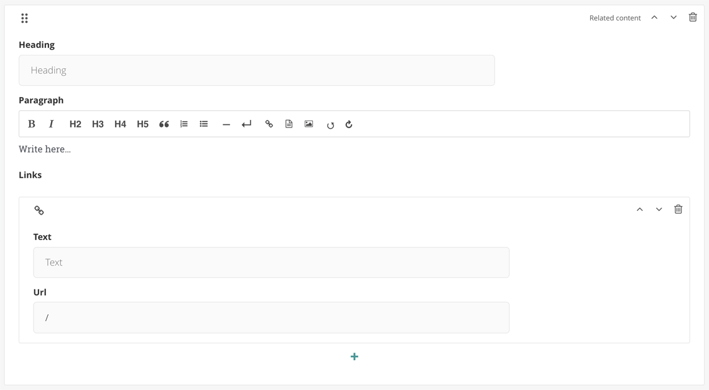

# Creating and Editing Wagtail Components

consumerfinance.gov implements a number of components
that editors can choose from when building a page,
for example: Heroes, Expandable Groups, or Info Unit Groups. The
[CFPB Design System](https://cfpb.github.io/design-system/components/)
describes the design and intended usage of many of these components.

In Wagtail parlance, these are called
["StreamField blocks"](https://docs.wagtail.io/en/stable/topics/streamfield.html)*
(or just "blocks").
We sometimes also refer to them as "modules", because we think that
the terms "component" and "module" may be more obvious to non-developers.
This page will use the terms somewhat interchangeably.
One other important thing to note before we begin:
blocks can be nested within other blocks.

_* If you're going to be doing anything more than making minor updates to
   existing components, this is highly recommended reading._


## Table of contents

1. [The parts of a Wagtail block](#the-parts-of-a-wagtail-block)
    1. [The back end](#the-back-end)
        1. [The Python class](#the-python-class)
        1. [Adding it to a StreamField](#adding-it-to-a-streamfield)
    1. [The front end](#the-front-end)
        1. [The HTML template](#the-html-template)
        1. [Adding CSS](#adding-css)
        1. [Adding JavaScript](#adding-javascript)
1. [How-to guides](#how-to-guides)
    1. [Creating a new component](#creating-a-new-component)
    1. [Adding a field to an existing component](#adding-a-field-to-an-existing-component)
    1. [Editing a field on an existing component](#editing-a-field-on-an-existing-component)
    1. [Removing a field from an existing component](#removing-a-field-from-an-existing-component)
    1. [Creating migrations for StreamField blocks](#creating-migrations-for-streamfield-blocks)


## The parts of a Wagtail block

Blocks are implemented via several different bits of code:

1. [Defining a block's fields and other properties in a Python class](#the-python-class)
1. [Adding the class to a page's StreamField block options](#adding-it-to-a-streamfield)
1. [Creating an HTML template for rendering the block on a page](#the-html-template)
1. [(Optionally) adding some CSS for styling the block](#adding-css)
1. [(Optionally) adding some JavaScript for adding advanced behavior](#adding-javascript)

Before you dive in further,
[check out the Notes on Atomic Design page](../atomic-structure/)
and familiarize yourself with our basic concepts
of atoms, molecules, and organisms.


### The back end

#### The Python class

A component's fields and other properties are defined in a Python class,
typically a subclass of Wagtail's
[`StructBlock`](http://docs.wagtail.io/en/stable/topics/streamfield.html#structblock).
These classes are located in a number of different files across the repository,
but there are two major categories they fall into:

1. Files corresponding to a general-purpose, site-wide atomic component.
   These files—`atoms.py`, `molecules.py`, and `organisms.py`—are located in
   [`cfgov/v1/atomic_elements`](https://github.com/cfpb/consumerfinance.gov/tree/main/cfgov/v1/atomic_elements).
2. Files that are specific to a particular sub-app, such as regulations3k's
   [blocks.py](https://github.com/cfpb/consumerfinance.gov/blob/main/cfgov/regulations3k/blocks.py).

There are other places where StreamField block classes are defined
(particularly blocks that are only ever used as fields within another block),
but these are the two most common locations
where top-level Wagtail modules are stored.

A simple component class looks like this:

```python
class RelatedContent(blocks.StructBlock):                      # 1
    heading = blocks.CharBlock(required=False)                 # 2
    paragraph = blocks.RichTextBlock(required=False)           # 3
    links = blocks.ListBlock(atoms.Hyperlink())                # 4

    class Meta:                                                # 5
        icon = 'grip'                                          # 6
        label = 'Related content'                              # 7
        template = '_includes/molecules/related-content.html'  # 8
```

There are a few things happening here:

1. The `RelatedContent` class is a subclass of
   [Wagtail's `StructBlock`](https://docs.wagtail.io/en/stable/topics/streamfield.html#structblock),
   which allows for the combination of a fixed number of other sub-blocks
   (see previous comment about blocks being nested within other blocks)
   into a single unit (what we'd think of as a "module" in the Wagtail editor).
   This one has three sub-blocks (lines 2, 3, and 4).
2. The `heading` field uses the basic Wagtail
   [`CharBlock`](https://docs.wagtail.io/en/stable/topics/streamfield.html#charblock),
   which results in a field with a basic single-line text input.
3. The `paragraph` field uses the basic Wagtail
   [`RichTextBlock`](https://docs.wagtail.io/en/stable/topics/streamfield.html#richtextblock),
   which results in a field with a multiline WYSIWYG text input.
4. The `links` field uses another basic Wagtail block,
   [`ListBlock`](https://docs.wagtail.io/en/stable/topics/streamfield.html#listblock),
   which is a special type of block that can hold a variable number of
   some other block (the `Hyperlink` atom block, in this case).
5. The `Meta` class defines some properties on the `RelatedContent` block
   that are used by the Wagtail admin or in rendering the block.
6. The `icon` property tells Wagtail what icon to use in the editor
   for the button you use to add a `RelatedContent` block to a StreamField.
   Icon options can be found in the Wagtail style guide when running locally:
   http://localhost:8000/admin/styleguide/#icons
7. The optional `label` property overrides the text of that same button;
   if `label` is not set, Wagtail will generate one from the name of the block.
8. The `template` property is a pointer to the HTML template used to render
   this component. [See below for more on templates.](#the-html-template)

This results in a module that looks like this in the Wagtail editor:



Note again that what we think of as **fields** are _also_ blocks,
and what we think of as **components** or **modules**
are a special kind of block, `StructBlock`,
that comprise the sub-blocks that are our fields.

There are two common optional things that are also used in component classes:

1. [Overriding the default `get_context` method](http://docs.wagtail.io/en/stable/topics/streamfield.html#streamfield-get-context)
   to pass additional data to the template
2. [Adding component-specific JavaScript](#adding-javascript)
    via the `Media` class

#### Adding it to a StreamField

Components are made available in the page editing interface
by adding them to one of a page types's StreamFields.
These are usually the first things in a page's class definition.
For example, see this snippet from
[`blog_page.py`](https://github.com/cfpb/consumerfinance.gov/blob/main/cfgov/v1/models/blog_page.py):

```python
class BlogPage(AbstractFilterPage):
    content = StreamField([
        ('full_width_text', organisms.FullWidthText()),
        ('info_unit_group', organisms.InfoUnitGroup()),
        ('expandable', organisms.Expandable()),
        ('well', organisms.Well()),
        ('email_signup', organisms.EmailSignUp()),
        ('feedback', v1_blocks.Feedback()),
    ])
    …
```

This sets up a StreamField named `content` that allows for
the insertion of any of those seven listed blocks into it.

To make the `RelatedContent` module (shown above) available to this StreamField,
we'd add a new entry to this list following the same format:
`('related_content', molecules.RelatedContent()),`.

Most page types have two StreamFields (`header` and `content`) in the
general content area (the first tab on an editing screen), and most also share
[a common `sidefoot` StreamField](https://github.com/cfpb/consumerfinance.gov/blob/main/cfgov/v1/models/base.py#L95-L107)
(so named for the fact that it appears on the right side on some page types,
but in the footer on others) on the sidebar tab.

---

!!! note "Don't forget the migrations!"
    Adding or changing fields on either Python class will always require a new
    [Django schema migration](https://docs.djangoproject.com/en/1.11/topics/migrations/);
    additionally, changing field names or types
    on an existing block will require a
    [Django data migration](https://docs.djangoproject.com/en/1.11/topics/migrations/#data-migrations).
    See the guide on
    [creating migrations for StreamField blocks](#creating-migrations-for-streamfield-blocks)
    for more details.


### The front end

Before diving into the front-end code, a reminder to
visit the [Notes on Atomic Design](../atomic-structure/) page
to learn about how we conceive of components in a hierarchy
of atoms, molecules, and organisms.

#### The HTML template

Frontend rendering of Wagtail StreamField blocks to HTML
can be controlled by writing a Django template
and associating it with the block type.
A custom block definition can specify the template path in its `Meta` class:

```python
from wagtail.core import blocks


class PersonBlock(blocks.StructBlock):
    name = blocks.CharBlock()
    email = blocks.EmailBlock()

    class Meta:
        template = 'myapp/blocks/person_block.html'
```

StreamField block templates are loaded by the Django template loader
in the same way that Django page templates are.
The specified template path must be loadable
by one of the Django template engines configured in
[`settings.TEMPLATES`](https://docs.djangoproject.com/en/1.11/ref/settings/#std:setting-TEMPLATES).
(This project supports both the standard
[Django templates backend](https://docs.djangoproject.com/en/2.1/topics/templates/#django.template.backends.django.DjangoTemplates)
and the
[Jinja2 backend](https://docs.djangoproject.com/en/2.1/topics/templates/#django.template.backends.jinja2.Jinja2),
but Jinja2 is more commonly used.)
[See the Django templates documentation](https://docs.djangoproject.com/en/1.11/topics/templates/#usage)
for more details on the search algorithm used to locate a template.

Returning to the `RelatedContent` example,
this is what its Jinja2 template looks like (comments excluded):

```html
<div class="m-related-content">
    
        <header class="m-slug-header">
            <h2 class="a-heading">
                {{ value.heading }}
            </h2>
        </header>
    

    {{ value.paragraph | safe }}

    
        <ul class="m-list m-list__links">
        
            <li class="m-list_item">
                <a href="{{ link.url }}" class="m-list_link">{{ link.text }}</a>
            </li>
        
        </ul>
    
</div>
```

When Wagtail renders a block,
it includes the values of its fields in an object named `value`.
Above, you can see where the `heading` and `paragraph` fields are output with
[Jinja2 expression tags](http://jinja.pocoo.org/docs/2.10/templates/#expressions).
And note how the `links` field (a `ListBlock`) is iterated over,
and the values of _its_ `Hyperlink` child blocks are output.

That's about as simple an example as it gets, but block templates can get much
more complex when they have lots of child blocks and grandchild blocks.
Also, if a block definition has overridden `get_context` to pass other data
into the template (as described at the end of
[the Python class section](#the-python-class) above),
those context variables can also be output with simple Jinja2 expression tags:
`{{ context_var }}`.

#### Adding CSS

If a component needs any custom styling not already provided
by the [Design System](https://github.com/cfpb/design-system) or consumerfinance.gov,
you can add it by creating a new
[Less](http://lesscss.org/) file for the component.

!!! note
    Please be sure that you actually need new Less before creating it.
    We have a wide array of styles already available in the
    [Design System components](https://cfpb.github.io/design-system/components/) and
    [here in consumerfinance.gov](https://github.com/cfpb/consumerfinance.gov/tree/main/cfgov/unprocessed/css),
    some of which could perhaps be combined to achieve your desired result.
    Also be sure that new component designs have gone through
    our internal approval process before adding them to the project.

If you're working on a general-purpose [atomic component](../atomic-structure/)
for site-wide use, this file should live in
`cfgov/unprocessed/css/<atoms|molecules|organisms>/`.
(Choose the deepest folder according to the atomic rank of the component.)
Continuing the `RelatedContent` example, if it needed its own styles,
it would live at `cfgov/unprocessed/css/molecules/related-content.less`.

Newly-created Less files need to be imported into the project's main
`main.less` file, located at `cfgov/unprocessed/css/main.less`.
Please place them in the appropriate section for their atomic rank.

Because consumerfinance.gov uses `main.less` to build a single CSS file
for almost the entire project, it is not necessary
to tell the Python model anything about a component-specific stylesheet
(for general-purpose, site-wide components).
That is _not_ the case with JavaScript, as we will see in the next section.

!!! note
    If you're working on a component that belongs to a particular sub-app,
    its Less file should live in `cfgov/unprocessed/<app-name>/css/`.

#### Adding JavaScript

Each atomic component may optionally be given a `Media` class that can
list one or more JavaScript files that should be loaded when using it.
When a page is requested via the browser,
[code contained in `base.html`](https://github.com/cfpb/consumerfinance.gov/blob/main/cfgov/jinja2/v1/_layouts/base.html#L100-L110)
will loop all atomic components for the requested page and
load the appropriate atomic JavaScript bundles.

Here is how one would add the `Media` class to our `RelatedContent` example:

```python
class RelatedContent(blocks.StructBlock):
    …  # see first example on this page

    class Media:
        js = ['related-content.js']
```

(The `related-content.js` file would need to be placed in
`cfgov/unprocessed/js/molecules/`;
see [Notes on Atomic Design](../atomic-structure/).)

This will load the `related-content.js` script on any page
that includes the `RelatedContent` molecule in one of its StreamFields.


## How-to guides


### Creating a new component

1. Review the [Notes on Atomic Design](../atomic-structure/) page.
1. Add each of the parts mentioned above:
    1. [Create the Python class](#the-python-class)
    1. [Add the class to a StreamField](#adding-it-to-a-streamfield)
    1. [Create an HTML template for the component](#the-html-template)
    1. [(Optionally) add some CSS](#adding-css)
    1. [(Optionally) add some JavaScript](#adding-javascript)

!!! note
    Before creating a new component,
    please consider whether one of our existing components can meet your needs.
    Talk to the consumerfinance.gov product owners if
    your content has specific display requirements that aren't served
    by an existing component, or if
    a specific maintenance efficiency will be gained from a new component.


### Adding a field to an existing component

1. Locate the Python class of the component you want to add a field to.
1. Add the field by inserting a snippet like this in the list of fields,
   in the order in which you want it to appear in the editor:
   `field_name = blocks.BlockName()`.
    - Replace `field_name` with a succinct name for what data the field contains
    - Replace `BlockName` with one of the
      [basic Wagtail block types](https://docs.wagtail.io/en/stable/topics/streamfield.html#basic-block-types).
      Sometimes we create our own custom blocks that can be used, as well.
      See, for example, the
      [`HeadingBlock`](https://github.com/cfpb/consumerfinance.gov/blob/main/cfgov/v1/blocks.py#L147-L165),
      [used in `InfoUnitGroup`](https://github.com/cfpb/consumerfinance.gov/blob/main/cfgov/v1/atomic_elements/organisms.py#L54),
      among other places.
1. Add any desired parameters:
    - `required=False` if you do _not_ want the field to be required
      (it usually is, by default)
    - `label='Some label'` if you would like the editor to show a label more
      meaningful than the sentence-case transformation of the field name
    - `help_text='Some text'` if the field needs a more verbose explanation to
      be shown in the editor to make it clear to users how it should work
    - `default=<some appropriate value>` if you want the field to have a
      specific default value, e.g., `True` to have a `BooleanBlock` checkbox
      default to checked.
    - Certain blocks may take other arguments, as described in the
      [basic Wagtail blocks documentation](https://docs.wagtail.io/en/stable/topics/streamfield.html#basic-block-types).
1. [Edit the component template](#the-html-template) to do something with the
   field's data – output it, use it to trigger a CSS class, etc.
1. [Create a schema migration.](#creating-migrations-for-streamfield-blocks)


### Editing a field on an existing component

1. [Determine if the change you want to make will need a data migration.](#you-may-also-need-a-data-migration)
    - If the answer is **no**: make your changes,
      [create a schema migration](#creating-migrations-for-streamfield-blocks), and be on your merry way.
    - If the answer is **yes**: continue on.
1. [Add the new version of the field.](#adding-a-field-to-an-existing-component)
1. [Create a schema migration](#creating-migrations-for-streamfield-blocks) for adding the new field.
1. [Create a data migration](#you-may-also-need-a-data-migration)
   to copy data from the old field into the new field.
1. [Edit the component template](#the-html-template)
   to use the new field's data instead of the old field's data.
1. [Remove the old field.](#removing-a-field-from-an-existing-component)
1. [Create a schema migration](#creating-migrations-for-streamfield-blocks) for removing the old field.


### Removing a field from an existing component

These instructions presume that you do not care
about any data stored in the field you are deleting.
If that is not the case, please go up to the
[instructions for editing a field](#editing-a-field-on-an-existing-component)
and come back here when instructed.

1. Locate the field you want to remove in the block's Python class.
1. Delete the field definition.
1. [Create a schema migration.](#creating-migrations-for-streamfield-blocks)


### Creating migrations for StreamField blocks

To automatically generate a **schema migration**, run
`./cfgov/manage.py makemigrations -n <description_of_changes>`
from the root of the repository.

#### You may also need a data migration

Some field edits (like changing the `default`, `label`, `help_text`,
and `required` properties, or changing the order of fields on a block)
do not require a data migration. A schema migration is sufficient.

Data migrations are required any time you:

- rename an existing field
- change the type of an existing field
- delete an existing field
- rename a block within a StreamField
- delete a block

if you do not want to lose any data already stored in that field or block.

In other words, if an existing field or block is changing,
any data stored in that field or block has to be migrated to a different place,
unless you're OK with jettisoning it.

##### Not sure if there's actually any data that could potentially be lost?

You may not know off the top of your head if a component you are modifying
actually has any data stored that could be lost.
One way that you can manually check to see if this is the case
is to use the Block Inventory feature that
[we added to Wagtail](https://github.com/cfpb/wagtail-inventory).
This feature lets you search all Wagtail pages on the site
for the presence of a component. Here's how:

1. With a current database dump, visit http://localhost:8000/admin/inventory/.
   (This is also available from the admin menu by going to
   **Settings** > **Block Inventory**.)
1. Using the three pairs of dropdown menus at the top of the page,
   choose to look for pages that either
   _include_ or _exclude_ particular components.
    - If multiple components are selected, resulting pages must
      match _all_ of the conditions.
1. Click **Find matching pages** to execute the search.
1. If no results are found, lucky you!
   You're in the clear to make whatever changes you desire to that component
   without worrying about data loss.
1. If, more likely, there _are_ results, you should open each result,
   look through the page for the instance(s) of the component in question, and
   see if the changes you want to make would cause the loss of important data.

If there is only a small amount of potential data loss,
it may be more practical to forego the data migration and
manually replace that data once the code changes have been deployed.
If you think this is the preferable route,
consult with the appropriate stakeholders to confirm that
they are OK with the window of time in which users may
experience a gap in the data that is being manually replaced.

---

For more details on both kinds of migrations,
see [the Wagtail Migrations page](../migrations/).
