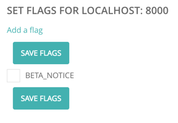

# Feature flags

Feature flags are implemented using our [Wagtail-Flags](https://github.com/cfpb/wagtail-flags) app. The [README](https://github.com/cfpb/wagtail-flags/blob/master/README.md) contains an overview and examples of how to use feature flags in Wagtail.


Here flags can added, enabled, or disabled:



The flag consists of a single string (by convention all uppercase, with underscores instead of whitespace). Flags are disabled by default, and checks for flags that do not exist will return False.

Once a flag has been created it can be checked in Python and Jinja2 templates using the functions [documented in the Wagtail-Flags README](https://github.com/cfpb/wagtail-flags/blob/master/README.md#usage).

## Python example

```python
from flags.template_functions import flag_enabled, flag_disabled

if flag_enabled(request, 'BETA_NOTICE'):
	print(“Beta notice banner will be displayed”)

if flag_disabled(request, 'BETA_NOTICE'):
	print(“Beta notice banner will not be displayed”)
```

The `flags_enabled` method is also provided as a shortcut when checking that multiple flags are all set.

```python
from flags.template_functions import flags_enabled

if flags_enabled(request, 'FLAG1', 'FLAG2', 'FLAG3'):
	print(“All flags were set”)

```

You can also use the `flag_required` method decorator to mark Django views as requiring a flag. The default behavior is to return a 404 if the flag is not set, but an optional fallback view function can be specified instead.

```python
from flags.decorators import flag_required

@flag_required('MY_FLAG')
def view_requiring_flag(request):
    retrun HttpResponse('flag was set')

def other_view(request):
    return HttpResponse('flag was not set')

@flag_required('MY_FLAG', fallback_view=other_view)
def view_with_fallback(request):
    return HttpResponse('flag was set')
```

## Jinja2 template example:

```

    <div class="m-global-banner">
I’m a beta banner.   
    </div>

```

## Feature flag hygiene

Feature flags should be rare and ephemeral. Changes should be small and frequent, and not big-bang releases, and flags that are no longer used should be cleaned up and removed from code and the database.
