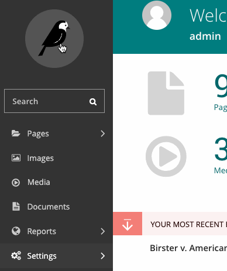

# Feature flags

Feature flags are implemented using our [Django-Flags](https://github.com/cfpb/django-flags) and [Wagtail-Flags](https://github.com/cfpb/wagtail-flags) apps. The [Django-Flags documentation](https://cfpb.github.io/django-flags) contains an overview of feature flags and how to use them and the [Wagtail-Flags README](https://github.com/cfpb/wagtail-flags/blob/main/README.md) describes how to add feature flag conditions in the Wagtail admin.

This document covers how to add and use feature flags with consumerfinance.gov and the conventions we have around their use.

- [Adding a flag](#adding-a-flag)
- [Checking a flag](#checking-a-flag)
	- [In templates](#in-templates)
		- [Jinja2](#jinja2)
		- [Django](#django)
	- [In code](#in-code)
	- [In URLs](#in-urls)
- [Enabling a flag](#enabling-a-flag)
	- [Hard-coded conditions](#hard-coded-conditions)
	- [Database conditions](#database-conditions)
- [Satellite apps](#satellite-apps)
- [Hygiene](#hygiene)

## Adding a flag

Feature flags are defined in code in the [`cfgov/settings/base.py`](https://github.com/cfpb/consumerfinance.gov/blob/main/cfgov/cfgov/settings/base.py#L562) file as part of the `FLAGS` setting. Each flag consists of a single string and a Python list of its hard-coded conditions (see [Enabling a flag](#enabling-a-flag) below).

```python
FLAGS = {
    # Beta banner, seen on beta.consumerfinance.gov
    # When enabled, a banner appears across the top of the site proclaiming
    # "This beta site is a work in progress."
    'BETA_NOTICE': [],
}
```

By convention our flag names are all uppercase, with underscores instead of whitespace. A comment is expected above each flag with a short description fo what happens when it is enabled.

## Checking a flag

Flags can be checked either in Python code or in Django or Jinja2 template files. See the full [Wagtail Flags API is documented ](https://github.com/cfpb/wagtail-flags/blob/main/README.md#api) for more information.

### In templates

#### Jinja2

Most of consumerfinance.gov's templates are Jinja2. In these templates, two template functions are provided, `flag_enabled` and `flag_disabled`. Each takes a flag name as its first argument and request` object as the second.

`flag_enabled('MY_FLAG')` will return `True` if the conditions under which `MY_FLAG` is enabled **are** met.

`flag_disabled('MY_FLAG')` will return `True` if the conditions under which `MY_FLAG` is enabled **are not** met.

See [Enabling a flag](#enabling-a-flag) below for more on flag conditions.

An example is [the `BETA_NOTICE flag` as implemented in `header.html`](https://github.com/cfpb/consumerfinance.gov/blob/main/cfgov/jinja2/v1/_includes/organisms/header.html#L21-L56):

```jinja

<div class="m-global-banner">
    <div class="wrapper
                wrapper__match-content
                o-expandable
                o-expandable__expanded">
        <div class="m-global-banner_head">
            <span class="cf-icon
                         cf-icon-error-round
                         m-global-banner_icon"></span>
            This beta site is a work in progress.
        </div>
        …
    </div>
</div>

```

#### Django

In Django templates (used in Satellite apps and the Wagtail admin), two template functions are provided `flag_enabled` and `flag_disabled` once the `feature_flags` template tag library is loaded.

`flag_enabled 'MY_FLAG'` will return `True` if the conditions under which `MY_FLAG` is enabled **are** met.

`flag_disabled 'MY_FLAG'` will return `True` if the conditions under which `MY_FLAG` is enabled **are not** met.

See [Enabling a flag](#enabling-a-flag) below for more on flag conditions.

The `BETA_NOTICE` [Jinja2](#jinja2) example above when implemented with Django templates would look like this:

```django




<div class="m-global-banner">
    <div class="wrapper
                wrapper__match-content
                o-expandable
                o-expandable__expanded">
        <div class="m-global-banner_head">
            <span class="cf-icon
                         cf-icon-error-round
                         m-global-banner_icon"></span>
            This beta site is a work in progress.
        </div>
        …
    </div>
</div>

```

### In code

In Python code three functions are available for checking feature flags, `flag_state`, `flag_enabled`, and `flag_disabled`. The Python API is slightly different from the [Jinja2](#jinja2) or [Django template](#django) API, in that flag conditions can take more potential arguments than requests, and thus flags are more flexible when checked in Python (in and outside a request cycle).

See the [Django-Flags flag state API documentation for more](https://cfpb.github.io/django-flags/api/state/).

Additionally two decorators, `flag_check` and `flag_required`, are provided for wrapping views (and another functions) in a feature flag check.  See the [Django-Flags flag decorators API documentation for more](https://cfpb.github.io/django-flags/api/decorators/).

### In URLs

There are two ways to flag Django URL patterns in `urls.py`: with `flagged_url()` in place of `url()` for a single pattern, or with the `flagged_urls()` context manager for multiple URLs.

`flagged_url(flag_name, regex, view, kwargs=None, name=None, state=True, fallback=None)` works exactly like `url()` except it takes a flag name as its first argument. If the flag's state matches the given `state`, the URL pattern will be served from the given `view`; if not, and `fallback` is given, the `fallback` will be used.

An example is [our `WAGTAIL_ABOUT_US` flag](https://github.com/cfpb/consumerfinance.gov/blob/4c3521e967abc5a35fc42566ae409d6ba008f81e/cfgov/cfgov/urls.py#L204-L210):

```python
flagged_url('WAGTAIL_ABOUT_US',
            r'^about-us/$',
            lambda req: ServeView.as_view()(req, req.path),
            fallback=SheerTemplateView.as_view(
                template_name='about-us/index.html'),
            name='about-us'),
```

Ignoring the `view` being a `lambda` for now (see [Flagging Wagtail URLs below](#flagging-wagtail-urls)), this URL will be served via Wagtail if `WAGTAIL_ABOUT_US`'s conditions are `True`, and from a `TemplateView` if its conditions are `False`.

If you need to flag multiple URLs with the same flag, you can use the `flagged_urls()` context manager.

`with flagged_urls(flag_name, state=True, fallback=None) as url` provides a context in which the returned `url()` function can be used in place of the Django `url()` function in patterns and those patterns will share the same feature flag, state, and fallback.

An example is [our `WAGTAIL_ASK_CFPB` flag](https://github.com/cfpb/consumerfinance.gov/blob/3cd79689aac7e22e3c2f07373a7db7f2fbbed304/cfgov/cfgov/urls.py#L405-L433):

```python
with flagged_urls('WAGTAIL_ASK_CFPB') as url:
    ask_patterns = [
        url(r'^(?i)ask-cfpb/([-\w]{1,244})-(en)-(\d{1,6})/?$',
            view_answer,
            name='ask-english-answer'),
        url(r'^(?i)obtener-respuestas/([-\w]{1,244})-(es)-(\d{1,6})/?$',
            view_answer,
            name='ask-spanish-answer'),
        …
    ]

urlpatterns += ask_patterns
```

!!! Warning
    Do not attempt to use `flag_check` or any flag state-checking functions in `urls.py`. Because they will be evaluated on import of `urls.py` they will attempt to access the Django FlagState model before it is ready and will error.

#### Flagging Wagtail URLs

Wagtail views in `flagged_url` with a Django view as fallback (or vice-versa) can be a bit awkward. Django views are typically called with `request` as the first argument, and Wagtail's `serve` view takes both the request and the path. To get around this, in `flagged_url` we typically use a `lambda` for the view:

```python
lambda req: ServeView.as_view()(req, req.path)
```

This lambda takes the request and calls the [Wagtail-Sharing](https://github.com/cfpb/wagtail-sharing) `ServeView` (which we're using in place of `wagtail.core.views.serve`).

## Enabling a flag

Feature flags are enabled based on a set of conditions that are given either in the Django settings files (in `cfgov/cfgov/settings/`) or in the Django or Wagtail admin. Multiple conditions can be given, both in settings and in the admin, and if any condition is satisfied a flag is enabled.

[A list of available conditions and how to use them is available in the Django-Flags documentation](https://cfpb.github.io/django-flags/conditions/).


### Hard-coded conditions

Conditions that are defined in the Django settings are hard-coded, and require a change to files in consumerfinance.gov, a new tagged release, and new deployment to change. These conditions should be used for flags that are relatively long-lasting and that can require a round-trip through the release and deployment process to change.

When [adding a flag](#adding-a-flag) to the Django settings the flag's dictionary of conditions can contain a condition name and value that must be satisfied for the flag to be enabled. The nature of that value changes depending on the condition type. [See the Django-Flags conditions documentation](https://cfpb.github.io/django-flags/conditions/) for more on individual conditions.

There is a simple `boolean` condition that is either `True` or `False`, and if it is `True` the flag is enabled and if it is `False` the flag is disabled. If we want to always turn the `BETA_NOTICE` flag on in settings with a `boolean` condition, that would look like this:

```python
FLAGS = {
    # Beta banner, seen on beta.consumerfinance.gov
    # When enabled, a banner appears across the top of the site proclaiming
    # "This beta site is a work in progress."
    'BETA_NOTICE': [
        {
            'condition': 'boolean',
            'value': True,
        },
    ],
}
```

### Database conditions

Conditions that are managed via the Wagtail or Django admin are stored in the database. These conditions can be changed in real-time and do not require any code changes or release and deployment to change (presuming the code that uses the feature flag is in place).

To view, delete, and add database conditions, navigate to "Settings > Flags" in the Wagtail admin.



Once in the flag settings, you'll have a list of all flags and their statuses.


Select a flag to see its conditions.


Existing database conditions can be edited or deleted here.

To create a new database condition, select "Add a condition". As with [hard-coded conditions](#hard-coded-conditions), to create a database condition you must select which condition type you would like to use and give it a value that must be satisfied for the flag to be enabled.


Database conditions can only be set for flags that exist in the Django settings.

## Satellite apps

Feature flags can be used in satellite apps in exactly the same way they are used in consumerfinance.gov. An example is [the use of a feature flagged template choice in the complaintdatabase app](https://github.com/cfpb/complaint/blob/9985b4ea4ce5c6e9b55d57228520a92a26152565/complaintdatabase/views.py#L31-L36).

## Hygiene

Most feature flags are no longer needed once a feature is launched. Follow these steps to remove a flag when its job is done:

- Create a pull request that deletes the flag from settings, if it was declared there, and removes any related code and tests that referenced the flag.
- After the changes are merged and deployed to production, check `Settings ==> Flags` in Wagtail (`/admin/flags/`) to see if the removed flag is still listed. If so, the flag has been saved in our database. Select the flag, click the DELETE FLAG button at top right, and then choose YES, DELETE IT.

