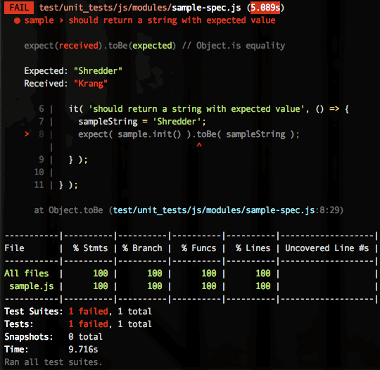
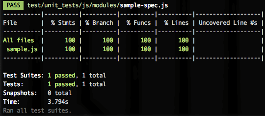
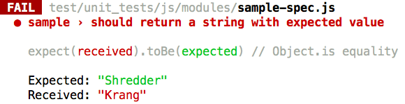

# JavaScript Unit Tests

This page provides instructions for writing and running
JavaScript (JS) unit tests in consumerfinance.gov.

[Jest](https://jestjs.io/docs/en/getting-started) is the framework we use
for writing and running JavaScript unit tests.
If you’re not familiar with it,
it would be a good idea to peruse their docs before diving in here.


## Table of contents

1. [Running unit tests](#running-unit-tests)
    1. [Running a single test file](#running-a-single-test-file)
    1. [Run a directory of unit tests](#run-a-directory-of-unit-tests)
    1. [Run all unit tests](#run-all-unit-tests)
1. [Where to find tests](#where-to-find-tests)
1. [Test-driven development](#test-driven-development)
1. [Setting up tests](#setting-up-tests)
    1. [New test file from sample](#new-test-file-from-sample)
    1. [Folder structure (where to put your JavaScript and tests)](#folder-structure-where-to-put-your-javascript-and-tests)
    1. [First test run](#first-test-run)
    1. [File structure (basic layout of a test file)](#file-structure-basic-layout-of-a-test-file)
    1. [Providing test data](#providing-test-data)
1. [Common test patterns](#common-test-patterns)
    1. [Testing a basic function](#testing-a-basic-function)
    1. [Testing DOM manipulation](#testing-dom-manipulation)
    1. [Testing browser state](#testing-browser-state)
    1. [Testing user interaction](#testing-user-interaction)


## Running unit tests


### Run a single test file

To run a single test file, pass the name (or path) of the spec:

```bash
yarn jest Notification-spec.js
# Equivalent to:
yarn jest test/unit_tests/js/molecules/Notification-spec.js
# The name argument would techniclly would match all Notification-spec.js files
# This usually isn't a problem in our codebase (and you can always get more specific if needed)
```

### Run a directory of unit tests

A directory of unit tests can be run by passing its name or path:

```bash
yarn jest organisms
yarn jest test/unit_tests/js/organisms
```

### Run all unit tests

To run all of the unit tests:

```bash
yarn jest
```

To first lint all files and then run tests:

```bash
yarn test
```

Because we invoke jest directly, you can pass any command-line args it accepts
to filter your output or to target specific tests [see the docs for more](https://jestjs.io/docs/cli).

## Where to find tests

The following links list out the main directories containing tests
(as of January 2019, this page’s initial publication date).

- [All unit tests](https://github.com/cfpb/consumerfinance.gov/tree/main/test/unit_tests)
- [Tests for individual apps](https://github.com/cfpb/consumerfinance.gov/tree/main/test/unit_tests/apps)
- [Tests for regular modules](https://github.com/cfpb/consumerfinance.gov/tree/main/test/unit_tests/js/modules)
- [Tests for molecules](https://github.com/cfpb/consumerfinance.gov/tree/main/test/unit_tests/js/molecules)
- [Tests for organisms](https://github.com/cfpb/consumerfinance.gov/tree/main/test/unit_tests/js/organisms)


## Test-driven development

We recommend using test-driven development (TDD) when coding new JavaScript.
The general concept is to start by writing your test **first**,
with the expected behavior and functionality well-described,
**then** you write the code that makes the test pass.
[A good pithy summary](http://www.javiersaldana.com/tech/2014/11/26/refactoring-the-three-laws-of-tdd.html)
is:

> 1.  Write only enough of a unit test to fail.
> 2.  Write only enough production code to make the failing unit test pass.

Then repeat that process until you have written all of the code you need.

[Read this primer on test-driven development](https://medium.freecodecamp.org/test-driven-development-what-it-is-and-what-it-is-not-41fa6bca02a2?gi=3c8d8b476cc9)
to learn more about how it differs from
the typical approach to programming and unit tests.


## Setting up tests


### New test file from sample

For this guide, we’ll use very basic sample code files
to illustrate how to use the test framework in consumerfinance.gov
and how to test very common code patterns.

Another common approach is to look for existing tests
that are testing something similar to what you are writing now.
Feel free to do so and copy from an existing module and its tests
instead of copying the sample files referenced below.
For links to existing tests,
[refer back to the “Where to find tests” section](#where-to-find-tests).

Now, let’s begin! Let’s make a new unit test fail,
then we will make it pass, following the principles of TDD.

1. Copy the sample test file to a new location by
   running this command from the root of consumerfinance.gov:

    ```bash
    cp docs/samples/sample-spec.js test/unit_tests/js/modules/
    ```

1. Copy the sample module file to a new location by running this command:

    ```bash
    cp docs/samples/sample.js cfgov/unprocessed/js/modules/
    ```

Test file names should always match what they are testing,
with the addition of a `-spec` suffix.


### Folder structure (where to put your JavaScript and tests)

JavaScript unit test files belong in the
[`test/unit_tests/`](https://github.com/cfpb/consumerfinance.gov/tree/main/test/unit_tests)
directory.

The folder structure of the test files mirrors
the structure of the project JavaScript in
[`cfgov/unprocessed/js/`](https://github.com/cfpb/consumerfinance.gov/tree/main/cfgov/unprocessed/js).

When considering exactly where to place JavaScript in these directories,
it might be helpful to review the documentation about
[atomic components in consumerfinance.gov](../atomic-structure).
JavaScript corresponding to atomic elements should go into
the appropriate subfolder for the type of element being implemented.
In our case, `sample.js` and `sample-spec.js` don’t relate to atomic elements,
so they can be placed into the uncategorized `modules` subfolders:
`cfgov/unprocessed/js/modules` and `test/unit_tests/modules`, respectively.

!!! note "Child apps"
    If you’re working on something in a child app,
    put it in `test/unit_test/appname/js/`.
    Otherwise, if you’re working on something that
    belongs to consumerfinance.gov generally,
    it should go in the corresponding folder under `test/unit_test/js/`.


### First test run

Now that you have your sample JS and test files in the right places,
let’s try running them and see what happens!
I’ll refer to `sample-spec.js` and `sample.js` in the instructions below,
but you should work in your own new test file and JavaScript file
to save and commit your changes.

1. Edit line 6 of your spec file and remove the call to the `.skip` method.
   The line should now read:

    ```js
    it( 'should return a string with expected value', () => {
      …
    } );
    ```

1. Run your sample test using

    ```bash
    yarn jest sample-spec.js
    ```

    (substituting your own filename).

    You should see output like this:

    

    The test should fail – this is expected.
    Remember, when doing TDD, we want to write our test to fail first,
    then write the corresponding JavaScript that will make the test pass.

1. Make the test pass by changing your script’s line 7
   ([see `sample.js`](https://github.com/cfpb/consumerfinance.gov/blob/main/cfgov/unprocessed/js/modules/sample.js))
   to the following:

    ```js
    return 'Shredder';
    ```

1. Run the test again to confirm the test now passes.
   You should see output like this:

    

    Doesn’t it feel good?

[Refer back to the “Running unit tests” section](#running-unit-tests)
for additional commands to run tests.


### File structure (basic layout of a test file)

In order to make the `sample-spec.js` more meaningful to your own use case,
you’ll need to know how to structure a unit test using Jest methods.
Let’s take a look at the structure of our very basic sample test file.

#### Loading dependencies

Line 1 of any spec file will use an `import` statement to
include the JavaScript file that you are testing.
Additional dependencies should be added in the same manner.

```js
import sample from '../../../../cfgov/unprocessed/js/modules/sample.js';
```

Some test files use `const` declarations to
`require` scripts instead of `import`,
because those files were written before `import` was available.
We prefer to use `import` because it allows for
[tree shaking in Webpack](https://webpack.js.org/guides/tree-shaking/),
meaning if two modules are importing the same module
it should only be included in the bundle once,
whereas with `require` it would be included twice.

A consequence is that variables can’t be used in the import path,
as they prevent Webpack from figuring out which modules are duplicates.
For example, this snippet shows how a `require` statement
should be converted to an `import` statement,
but without including the `BASE_JS_PATH` variable in the file path:

```js
// This works, but could duplicate footer-button.js, if other files also require it.
const FooterButton = require( BASE_JS_PATH + 'modules/footer-button.js' );

// This doesn't work and the build will fail.
import * as FooterButton from BASE_JS_PATH + 'modules/footer-button.js';

// This is ugly, but it works and supports tree shaking.
import * as FooterButton from '../../../../cfgov/unprocessed/js/modules/footer-button.js';
```

`import` also provides a benefit in that you can choose specific parts
of a module so that you only import the dependencies you need.
For testing purposes, we will typically import the whole module
to make sure we have full test coverage.
[Read the `import` reference guide on MDN](https://developer.mozilla.org/en-US/docs/Web/JavaScript/Reference/Statements/import)
on how to implement `import` for different use cases.

#### The `describe` function

In Jest (whose syntax is based on Jasmine),
[`describe` blocks](https://jestjs.io/docs/en/api#describename-fn)
serve as organizational structures that you can use
to outline the methods you need in your JS module.

The root `describe` method is where we put
the name of the JavaScript module we are testing.
For the sample, the name of our module is `sample`,
so we set this up on line 4 of `sample-spec.js`:

```js
describe( 'sample', () => {
  …
} );
```

This module name will appear in your test output in the console
when the test is running:



More complex tests will have additional `describe` blocks –
children of the root `describe` block –
that should correspond to a particular method in the module.
For example, if we want to add more functionality to our sample JS,
we could start by writing these tests in `sample-spec.js`:

```js
describe( 'sample', () => {

  describe( 'gimmeString()', () => {

    it( 'should return a string with expected value', () => {
      const sampleString = 'Shredder';
      expect( sample.gimmeString() ).toBe( sampleString );
    } );

  } );

  describe( 'gimmeObject()', () => {

    it( 'should return an object with expected value', () => {
      const sampleObject = {
        image: 'https://vignette.wikia.nocookie.net/tmnt/images/0/00/Krangnobody.png',
        caption: 'Krang portrait'
      };
      expect( sample.gimmeObject() ).toBe( sampleObject );
    } );

  } );

} );
```

(We’ll talk more about writing the individual tests in the next section.)

And then we would create the `gimmeString` and `gimmeObject` methods
in our `sample.js` file.

Another example is
[`breakpoint-state-spec.js`](https://github.com/cfpb/consumerfinance.gov/blob/main/test/unit_tests/js/modules/util/breakpoint-state-spec.js),
which tests several methods, including `getBreakpointState` and `viewportIsIn`,
on the module `breakpoint-state`.

When using TDD, you may prefer to add `describe` blocks later,
during the refactor stage of writing code.

#### Individual tests

Within a `describe` block, individual tests are encapsulated by `it` methods,
which is an alias of
[Jest’s `test` method](https://jestjs.io/docs/en/api#testname-fn-timeout).

Each test must include one or more assertions (usually only one)
that confirm that the result of executing some code is what you expected.
These are called [“matchers”](https://jestjs.io/docs/en/using-matchers)
in Jest parlance, and they all follow this format:

```js
expect( someValue ).someKindOfComparisonWith( someOtherValue );
```

For example, let’s take another look at the sample tests we wrote above:

```js
describe( 'sample', () => {

  describe( 'gimmeString()', () => {

    it( 'should return a string with expected value', () => {
      const sampleString = 'Shredder';
      expect( sample.gimmeString() ).toBe( sampleString );
    } );

  } );

  describe( 'gimmeObject()', () => {

    it( 'should return an object with expected value', () => {
      const sampleObject = {
        image: 'https://vignette.wikia.nocookie.net/tmnt/images/0/00/Krangnobody.png',
        caption: 'Krang portrait'
      };
      expect( sample.gimmeObject() ).toBe( sampleObject );
    } );

  } );

} );
```

In these tests, we check _(`expect`)_ that
the string returned by `sample.gimmeString()`
and the object returned by `sample.gimmeObject()`
match _(`toBe`)_ the `sampleString` and `sampleObject`
that we defined in the tests.

There are many kinds of assertions you can use
besides the simple equality comparison of `toBe`.
See [the Jest Using Matchers guide](https://jestjs.io/docs/en/using-matchers)
for a primer on them and
[the Jest `expect` API docs](https://jestjs.io/docs/en/expect)
for the full list of its matchers.


### Providing test data

The first principle of test data for unit tests is to
**keep test data as simple as possible** –
use the minimum needed to test the code.

#### Direct definition of test data

The simplest way to set up test data is to
declare it as variables within each test, e.g., the tests in
[strings-spec.js](https://github.com/cfpb/consumerfinance.gov/blob/main/test/unit_tests/js/modules/util/strings-spec.js).
This can include HTML markup for DOM manipulation tests,
if each test requires different markup.

#### Setup and teardown methods

If you will need to leverage the same test data across different tests,
Jest has setup and teardown methods, such as
[`beforeEach` and `afterEach`](https://jestjs.io/docs/en/setup-teardown#repeating-setup-for-many-tests), or [`beforeAll` and `afterAll`](https://jestjs.io/docs/en/setup-teardown#one-time-setup),
which can be used to performing actions
that are needed before and after running all tests or each test in a suite.
For example, the tests in
[`Analytics-spec.js`](https://github.com/cfpb/consumerfinance.gov/blob/main/test/unit_tests/js/modules/Analytics-spec.js#L7-L32)
use both `beforeAll` and `beforeEach` inside the root `describe` block to
do a variable definition for all tests at the beginning of the suite
and reset the `dataLayer` before each test, respectively.

[Check out the Jest documentation on “Setup and teardown” methods.](https://jestjs.io/docs/en/setup-teardown)

A common structure when the DOM is involved
is to create a constant representing an HTML snippet to test,
then – in a `beforeEach` or `beforeAll`
(depending on whether the tests modify the markup or not) –
set `document.body.innerHTML` to that snippet.

Use `beforeAll` to attach HTML markup that is unaffected by the tests,
e.g., the tests in
[`footer-button-spec.js`](https://github.com/cfpb/consumerfinance.gov/blob/main/test/unit_tests/js/modules/footer-button-spec.js).
Use `beforeEach` to reset manipulated markup between tests, e.g., the tests in
[`Notification-spec.js`](https://github.com/cfpb/consumerfinance.gov/blob/main/test/unit_tests/js/molecules/Notification-spec.js).

[See “Testing DOM manipulation”](#testing-dom-manipulation)
in the “Common test patterns” section of this page
for a more in-depth discussion of this scenario.


## Common test patterns


### Testing a basic function

Testing simple functions is pretty straightforward.
Each function in a module should have tests set up as
a child `describe` within the module’s own `describe`.
Then, write a number of `it` statements in prose that describe
how the function should respond to various kinds of input.
Inside each `it`, invoke the function
with the input described in the `it` statement
and use `expect` to check that you receive the desired result.

Here is a simple example from our
[array helpers module](https://github.com/cfpb/consumerfinance.gov/blob/main/cfgov/unprocessed/js/modules/util/array-helpers.js)
(`cfgov/unprocessed/js/modules/util/array-helpers.js`):

```js
function indexOfObject( array, key, val ) {
  let match = -1;

  if ( !array.length > 0 ) {
    return match;
  }

  array.forEach( function( item, index ) {
    if ( item[key] === val ) {
      match = index;
    }
  } );

  return match;
}
```

Tests for that function, from
[test/unit_tests/js/modules/util/array-helpers-spec.js](https://github.com/cfpb/consumerfinance.gov/blob/main/test/unit_tests/js/modules/util/array-helpers-spec.js):

```js
describe( 'indexOfObject()', () => {
  it( 'should return -1 if the array is empty', () => {
    array = [];
    index = arrayHelpers.indexOfObject( array, 'foo' );

    expect( index ).toBe( -1 );
  } );

  it( 'should return -1 if there is no match', () => {
    array = [
      { value: 'bar' },
      { value: 'baz' }
    ];
    index = arrayHelpers.indexOfObject( array, 'value', 'foo' );

    expect( index ).toBe( -1 );
  } );

  it( 'should return the matched index', () => {
    array = [
      { value: 'foo' },
      { value: 'bar' },
      { value: 'baz' }
    ];
    index = arrayHelpers.indexOfObject( array, 'value', 'foo' );

    expect( index ).toBe( 0 );
  } );
} );
```


### Testing DOM manipulation

[Jest](https://jestjs.io/en/), the JavaScript testing framework we use,
[includes jsdom](https://jestjs.io/docs/en/configuration#testenvironment-string),
which simulates a DOM environment as if you were in the browser.
This means that we can call any
[DOM API](https://developer.mozilla.org/en-US/docs/Web/API/Document_Object_Model)
in our test code and observe it in the same way as we do
in the module code itself, which acts on the browser’s DOM.

As an example, let’s look at our Notification component.
The Notification component uses a common set of markup
with different classes and SVG icon code to style it
as a particular kind of notification (success, warning, etc.). In
[the component JS](https://github.com/cfpb/consumerfinance.gov/blob/main/cfgov/unprocessed/js/molecules/Notification.js),
we have this function that sets the type of a notification before displaying it:

```js
function _setType( type ) {
  // If type hasn't changed, return.
  if ( _currentType === type ) {
    return this;
  }

  // Remove existing type class
  const classList = _dom.classList;
  classList.remove(  `${ BASE_CLASS }__${ _currentType }` );


  if ( type === SUCCESS ||
       type === WARNING ||
       type === ERROR ) {
    // Add new type class and update the value of _currentType
    classList.add(  `${ BASE_CLASS }__${ type }` );
    _currentType = type;

    // Replace <svg> element with contents of type_ICON
    const currentIcon = _dom.querySelector( '.cf-icon-svg' );
    const newIconSetup = document.createElement( 'div' );
    newIconSetup.innerHTML = ICON[type];
    const newIcon = newIconSetup.firstChild;
    _dom.replaceChild( newIcon, currentIcon );
  } else {
    throw new Error( `${ type } is not a supported notification type!` );
  }
  return this;
}
```

This function would be invoked by an instance of the Notification class.
`_dom` is the DOM node for the Notification.
As you can see from the code comments above,
it has a few different steps that modify the DOM node.

Now let’s look at the tests.
Here are the first 22 lines of
[the spec file](https://github.com/cfpb/consumerfinance.gov/blob/main/test/unit_tests/js/molecules/Notification-spec.js)
that tests this component:

```js
import Notification from '../../../../cfgov/unprocessed/js/molecules/Notification';
const BASE_CLASS = 'm-notification';
const HTML_SNIPPET = `
  <div class="m-notification">
    <svg xmlns="http://www.w3.org/2000/svg" viewBox="0 0 1000 1200" class="cf-icon-svg"></svg>
    <div class="m-notification_content">
      <div class="h4 m-notification_message">Notification content</div>
    </div>
  </div>
`;

describe( 'Notification', () => {
  let notificationElem;
  let notification;
  let thisNotification;

  beforeEach( () => {
    document.body.innerHTML = HTML_SNIPPET;
    notificationElem = document.querySelector( `.${ BASE_CLASS }` );
    notification = new Notification( notificationElem, BASE_CLASS, {} );
  } );

  …
} );
```

The main things to note here at the beginning of the file are
the addition of the `HTML_SNIPPET` definition,
containing the markup we will used for testing
as it would be rendered for this component,
and the `beforeEach` function that
(1) uses jsdom to add that snippet to the test environment
and assigns the component node to the `notificationElem` variable, and
(2) creates a new instance of the Notification class.

!!! note "A word about `HTML_SNIPPET`s"
    Right now it’s possible to update a component’s Jinja template,
    forget to update the corresponding JavaScript,
    and the unit tests would still pass,
    because they're using their own `HTML_SNIPPET`.
    It would be preferable if we had a canonical component markup template
    that is pulled in by the application, the unit tests, and the docs.
    We haven’t yet figured out how to do this, since
    our component templates contain Jinja tags that
    the tests would have to reconcile
    into a complete, finished chunk of markup.
    For now, just be aware of this when
    [editing a Wagtail component that includes JavaScript](../editing-components/).

Further down, here are some of the tests that cover the `_setType` function
(by way of the `setTypeAndContent` function that
wraps both `_setType` and `_setContent`):

```js
describe( 'setTypeAndContent()', () => {
  it( 'should update the notification type for the success state', () => {
    notification.init();

    notification.setTypeAndContent(
      notification.SUCCESS,
      ''
    );

    expect( notificationElem.classList ).toContain( 'm-notification__success' );
  } );

  it( 'should update the notification type for the warning state', () => {
    notification.init();

    notification.setTypeAndContent(
      notification.WARNING,
      ''
    );

    expect( notificationElem.classList ).toContain( 'm-notification__warning' );
  } );

  …
} );
```

This part mostly works like testing any other function.
The notable distinction here is that the test invokes the function
using the DOM nodes and class set up in `beforeEach`.


### Testing browser state

Another common thing to test is code that interacts with
the state of the browser itself,
e.g., fragment identifiers, query strings, or other things in the URL;
the window object; session storage; page history; etc.

One way of doing this is to create a **spy**
(a special kind of mocked function)
that watches for browser API calls to be made
a certain number of times or with a specific payload.
One example is found in
[the tests for our full-table-row-linking code](https://github.com/cfpb/consumerfinance.gov/blob/main/test/unit_tests/js/modules/o-table-row-links-spec.js).

In
[the module code](https://github.com/cfpb/consumerfinance.gov/blob/main/cfgov/unprocessed/js/modules/o-table-row-links.js)
(`o-table-row-links.js`),
if an event listener detects a click anywhere on
one of these special table rows,
it invokes `window.location` to send the browser
to the `href` of the first link in that row:

```js
window.location.assign( target.querySelector( 'a' ).getAttribute( 'href' ) );
```

To test this, in the aforementioned `o-table-row-links-spec.js` file, we first
[set up a standard Jest mock](https://jestjs.io/docs/en/mock-functions)
for `window.location.assign`, and then
[create our spy](https://jestjs.io/docs/en/jest-object#jestspyonobject-methodname)
to watch it:

```js
describe( 'o-table-row-links', () => {
  beforeEach( () => {
    window.location.assign = jest.fn();
    locationSpy = jest.spyOn( window.location, 'assign' );
    …
  } );

  …
} );
```

A little further down (after finishing the DOM setup
and initializing the module we’re testing),
we have three tests that simulate clicks
and then assert things that the spy can answer for us:
whether it was called with a particular location parameter,
and that it was called a specific number of times (zero).

```js
it( 'should navigate to new location when link row cell clicked', () => {
  simulateEvent( 'click', linkRowCellDom );
  expect( locationSpy ).toBeCalledWith( 'https://www.example.com' );
} );

it( 'should not set window location when link is clicked', () => {
  simulateEvent( 'click', linkDom );
  expect( locationSpy ).toHaveBeenCalledTimes( 0 );
} );

it( 'should not navigate to new location when non link row cell clicked',
  () => {
    simulateEvent( 'click', nonLinkRowCellDom );
    expect( locationSpy ).toHaveBeenCalledTimes( 0 );
  }
);
```


### Testing user interaction

Testing user interaction with simulated pointer events, keystrokes,
or form submissions is best handled via browser tests, not unit tests.
User interaction in a unit test could falsely pass
if the component wasn’t visible on the page, for instance.
[Read more about how we run browser tests with Cypress.](../functional-testing/)
