# How to Edit the Mega Menu

## Page contents

- [Accessing the Mega Menu in Wagtail](#accessing-the-mega-menu-in-wagtail)
- [Editing Mega Menu items](#editing-menu-items)
    - [Editing Menu Item general information](#editing-menu-item-general-information)
    - [Editing navigation links and featured content](#editing-navigation-links-and-featured-content)
    - [Editing the Menu Item footer](#editing-the-menu-item-footer)
- [Mega Menu draft state](#mega-menu-draft-state)
    - [Block draft state](#block-draft-state)
    - [Link draft state](#link-draft-state)
- [Akamai cache](#akamai-cache)
    - [Clearing the cache](#clearing-the-cache)
    - [Previewing production changes](#previewing-production-changes)

## Accessing the Mega Menu in Wagtail

If you have permission to edit the menu in Wagtail, a **Mega Menu** link
will appear in the sidebar nav when you are logged into the Wagtail admin.
Clicking it will bring up a screen where you can add or edit Menu Items.

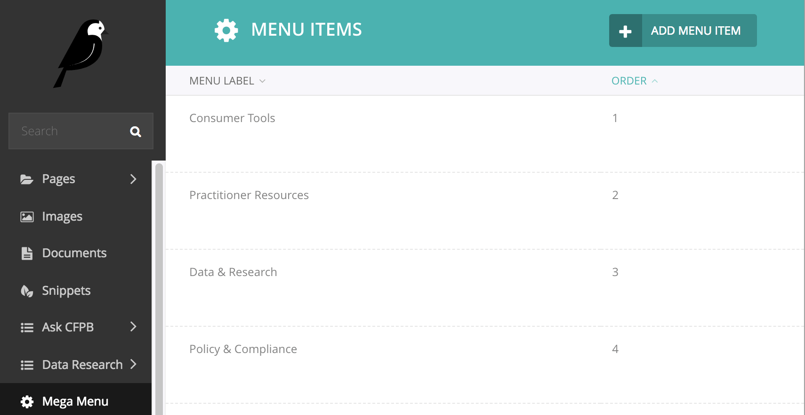

You can find more information about permissions in Wagtail on the
“Wagtail accounts and permissions (production)” page on the Platform wiki).

## Editing Menu Items

Each **Menu Item** represents a section (aka "vertical") in the mega menu,
like the Consumer Tools vertical below:

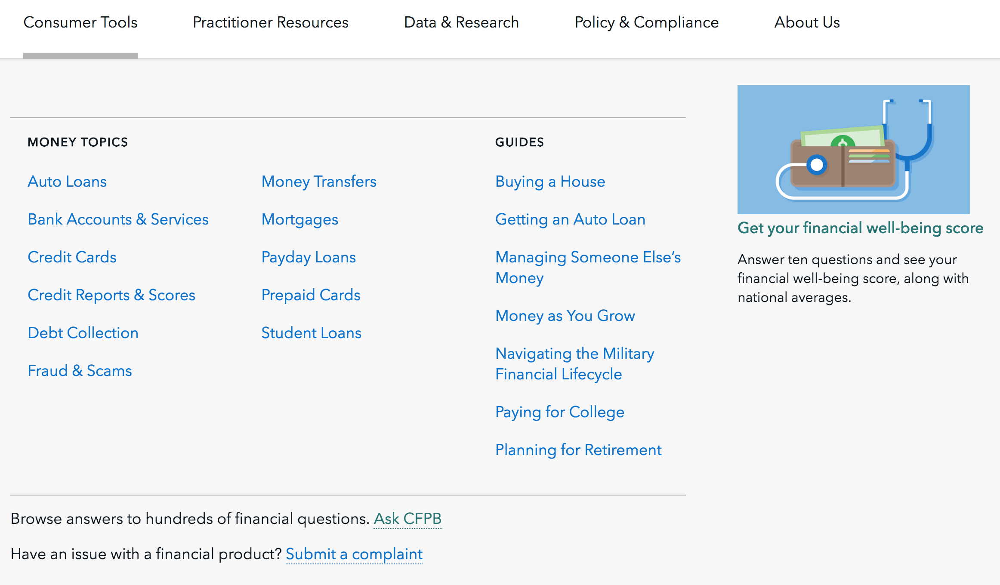

### Editing Menu Item general information

The name of the vertical (“Menu label”),
its Wagtail overview page (“Overview page link”),
and the order in which it appears in the cf.gov header (“Order”)
can be edited in the Menu Information and Order panels.

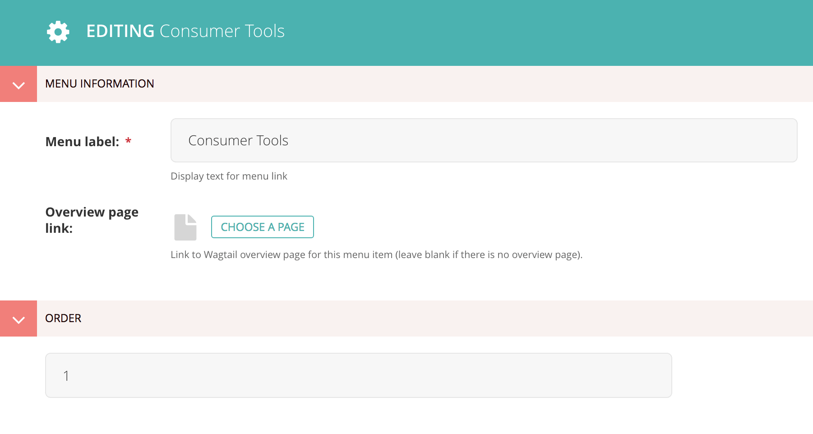

### Editing navigation links and featured content

A Menu Item has four column panels, one for each of its possible columns.
The first three columns can only contain groups of navigation links
(**Menu Items Group**), while the fourth also includes
a **Featured Image Item** option.

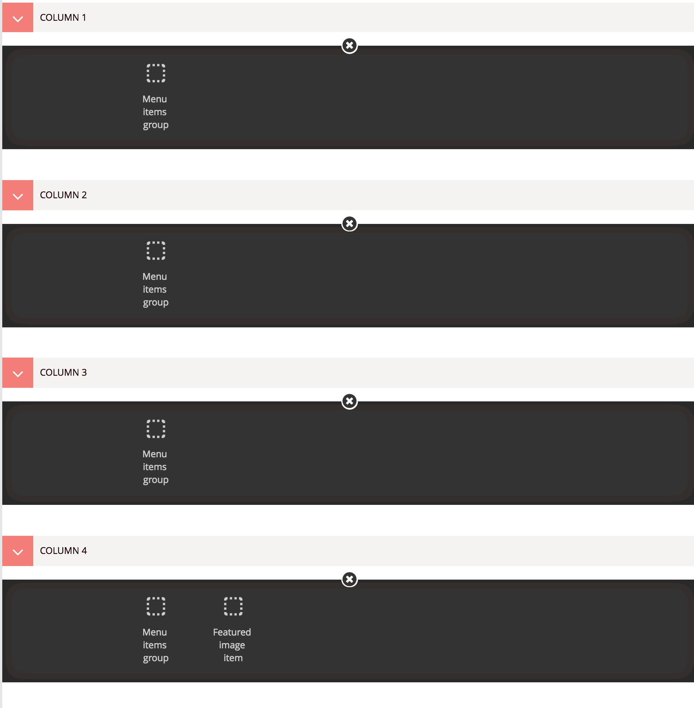

#### Navigation links – the Menu Items Group

The Menu Items Group block lets you manage a column’s navigation links.

Links are added to the “Menu items” list
(which is not to be confused with the _top-level_ Menu Item
that represents the main sections, or verticals, of the site).
Each link has a text field and options to specify either a Wagtail page
or the direct URL of a page outside of Wagtail.
See the main “Mega Menu” page on Hubcap for
editorial guidelines on writing links, link and character count guidance,
and specific guidelines for
the Consumer Tools and Practitioner Resources section links.

The optional “Child items” list lets you create a secondary level of navigation
for a link that will only be shown at screen sizes under 900px.
For example, in the Policy & Compliance vertical, each of the five main links
has child items that can be accessed in the small-screen version of the menu,
as indicated by the right arrows in the screenshot below.

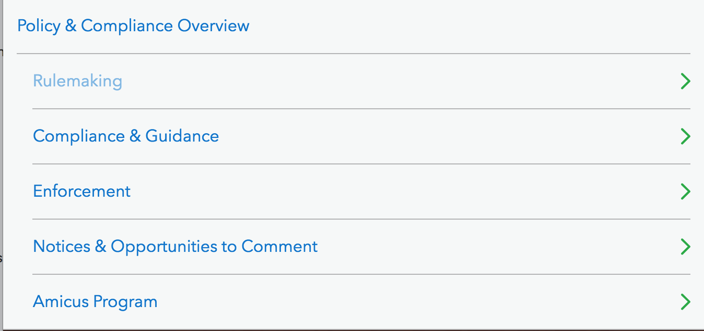

The optional “Column title” field lets you
specify a title that will be displayed above the column’s links.
Column titles should be brief and fit on one line at max screen width.
If two adjacent columns share the same title, enter the title in both columns,
but check the “Hide column title” box in the second column
so the title will only be displayed once (as in the Money Topics columns below).

#### Featured content – the Featured Image Item

The Featured Image Item block lets you feature a link to
a single resource in the last column of the menu vertical.
(This component used to be called “featured menu content”.)
It provides fields for the text of the link, its Wagtail page or external URL,
a short paragraph of supporting text, and an image.
Content guidelines for this block can be found on the “Featured Menu Content”
and “Mega Menu” pages on Hubcap.

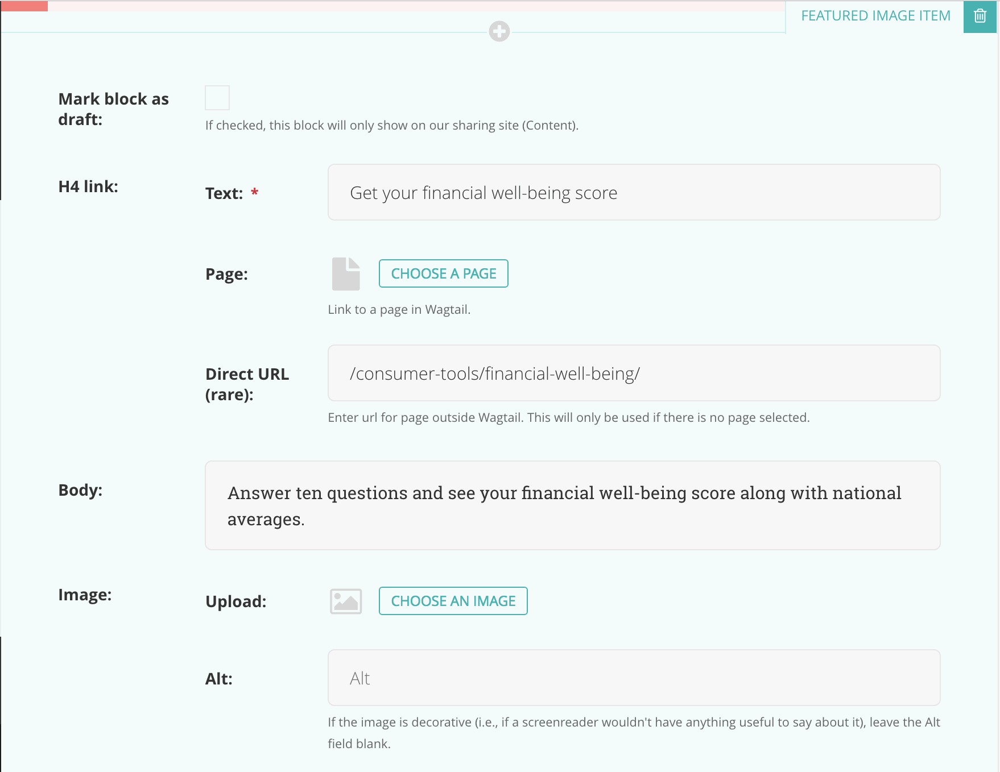

The Featured Image Item will be the only contents of its column:  

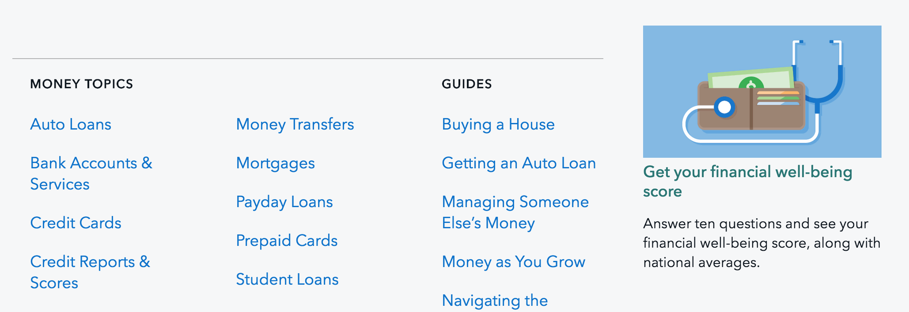

### Editing the Menu Item footer

The optional Nav Footer panel of a Menu Item can be used to
display links to related resources with optional additional text.
A **Menu Footer** block consists of a single “Content” rich text field that only accepts paragraphs and links.

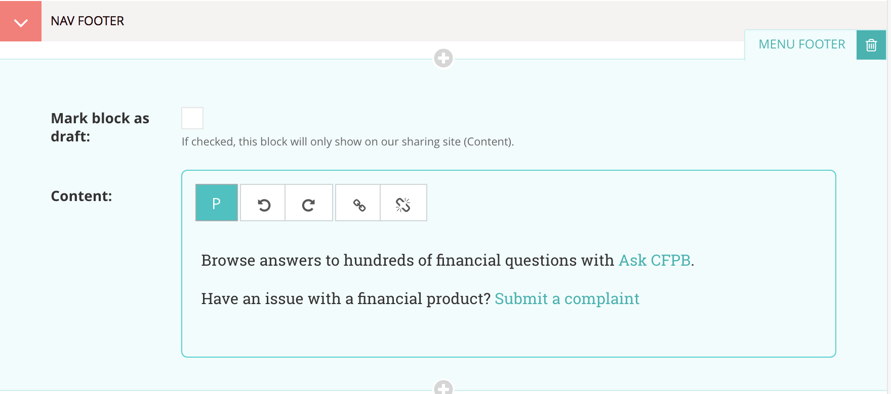

Footer items should be no longer than one line at max screen width, and can
either consist entirely of a link or be a brief sentence that ends in a link.
If a footer item contains non-link text, the full text of the item
will be automatically added as an `aria-label` attribute on its link
for users navigating the site via screen reader,
so it should be written to be comprehensible when read aloud.
Additional content guidance for footer links can be found on
the main “Mega Menu” page on Hubcap.

## Mega Menu draft state

Unlike Wagtail pages, Menu Items don’t have a **Save draft** option,
but if you have a sharing site set up with
[wagtail-sharing](https://github.com/cfpb/wagtail-sharing),
you can specify draft state for a particular block or link.
Blocks or links that are marked as draft will only
be shown on the sharing site and hidden on the live site.

When you add a block or link with draft state, you can verify that
it is only showing up on the sharing site
by checking the production servers directly.
[See the “Previewing production changes” section](#previewing-production-changes)
below for more information.

### Block draft state

The Menu Items Group, Featured Image Item, and Menu Footer blocks
all have a “Mark block as draft” checkbox:

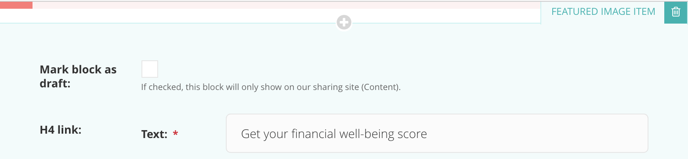

If you want to test different column or footer content
(like a new Featured Image Item or updated Menu Footer),
add another block to the section and check its “Mark block as draft” field.
The new block will only be displayed on the sharing site,
while the non-draft block will continue to be displayed on the live site.

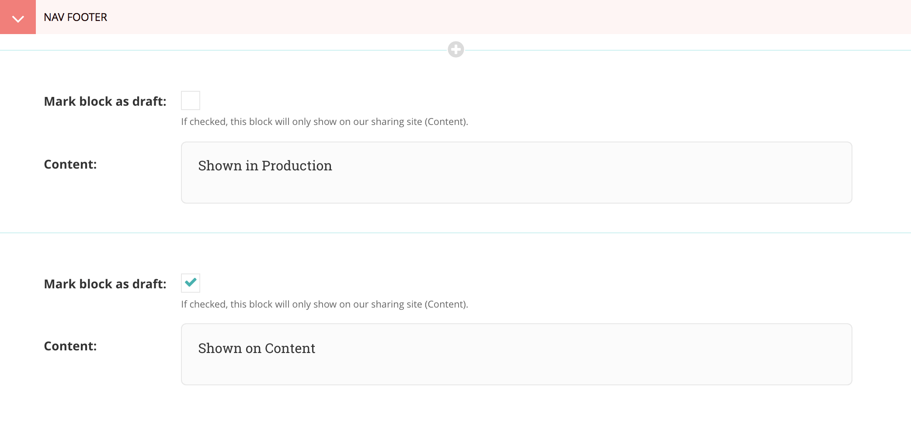

When you’re ready to publish the new block,
uncheck the draft box on the new block.
You can now either delete the old block or move the new block up
so it is the first block in its section.
When there are multiple blocks in a section,
the code that generates the production version of the menu
looks for the first block that isn’t in draft state,
so either way, your new block will now be displayed in production
once the cache is cleared.

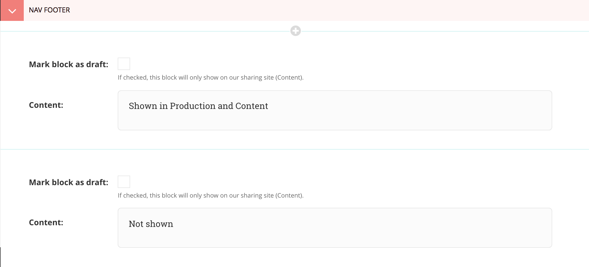

Since we don’t save revisions of Menu Items,
it might be safer to temporarily keep the old block
until the new one is successfully deployed to production.

### Link draft state

Instead of a “Mark as draft” checkbox, links within a Menu Items Group
have a “State” field with three options:

If you want to test a new link (or a new version of an existing link),
click the **Add another** button to create a new link
and set it to “Show on Content only”.
The new link will now only appear on the sharing site.
If you are testing a new version of an existing link,
you can either set the original link to “Show on Production only”
or leave it as “Show always”, depending on whether you want
both versions to show up on the sharing site.
Anything marked as “Show always” (the default value of the State field)
will show on both the sharing and live sites.

## Akamai cache

### Clearing the cache

Since the mega menu is cached on all pages, the Akamai cache must be flushed
to make changes to the menu on the live site.
See the “Flushing the Akamai cache” page on Hubcap for instructions.

### Previewing production changes

You can preview changes to the production version of the menu
before clearing the Akamai cache by going to the internal hostname
of a production server.
By hitting the server directly, the Akamai cache is bypassed,
so it will show the updated menu as soon as a change is saved to a Menu Item.
This is a good way to make sure that changes are displaying correctly
before generally pushing them out to to the live site by flushing the cache.
