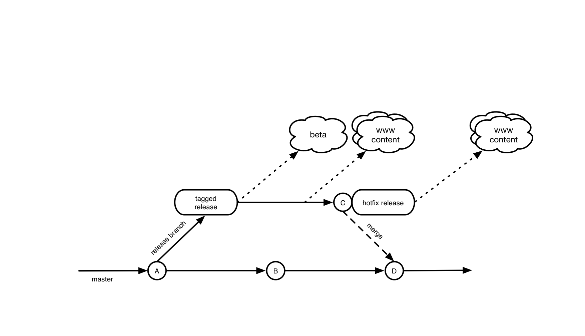

# Release Cadence

cf.gov is on a two-week release cadence. The release process is as follows:

- A new branch is created from the master branch representing the next minor release, e.g. 5.1. 
- A new release is tagged from that branch with a 0 patch number, e.g. 5.1.0. The CHANGELOG is updated to reflect the new release.
- That release is deployed to our beta server ("beta").
- If any fixes are necessary before going to production, they are committed to the release branch, and back-merged to master. New "hotfix" releases are tagged from the branch with the appropriate patch number as needed to get urgent changes onto beta.
- The latest release tagged on the release branch is deployed to production servers ("content" and "www"). 
- If any urgent changes are needed before the next release is deployed to www and content, they are treated as hotfixes to the production release branch. Hot-fixes are committed to the release branch, and increment the patch number. For example, the first hotfix of 5.1 will be 5.1.1.

## Sample schedule

Monday | Tuesday | Wednesday | Thursday | Friday
------ | ------- | --------- | -------- | ------
| | | 5.1 branched, 5.1.0 released, deployed to beta | Hotfix 5.1.1 committed, released, deployed to beta |
| 5.1.1 deployed to www and content | | Hotfix 5.1.2 committed, released, deployed to www and content | | |
| | | 5.2 branched, 5.2.0 released, deployed to beta |
