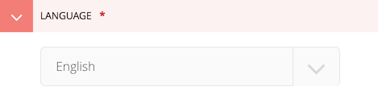

# Translation

As consumerfinance.gov is a Django project, the [Django translation documentation is a good place to start](https://docs.djangoproject.com/en/1.11/topics/i18n/translation/). What follows is a brief introduction to translations with the particular tools consumerfinance.gov uses (like Jinja2 templates) and the conventions we use.

## Overview

Django translations use [GNU gettext](https://en.wikipedia.org/wiki/Gettext) (see
[the installation instructions](installation.md#install-gnu-gettext-for-django-translation-support)).

By convention, translations are usually performed in code by wrapping a string to be translated in a function that is either named or aliased with an underscore. For example:

```python
_("This is a translatable string.")
```

These strings are collected into portable object (`.po`) files for each supported language. These files map the original string (`msgid`) to a matching translated string (`msgstr`). For example:

```po
msgid "This is a translatable string."
msgstr "Esta es una cadena traducible."
```

These portable object files are compiled into machine object files (`.mo`) that the translation system uses when looking up the original string.

By convention the `.po` and `.mo` files live inside a `locale/[LANGUAGE]/LC_MESSAGES/` folder structure, for example, `cfgov/locale/es/LC_MESSAGES/django.po` for the Spanish language portable object file for all of our consumerfinance.gov messages.

## How to translate text in consumerfinance.gov

This brief howto will guide you through adding translatable text to consumerfinance.gov.

#### 1. Add the translation function around the string

In Jinja2 templates:

```jinja
{{ _("Hello World!") }}
```

In Django templates:

```django



```

In Python code:

```python
from django.utils.translation import ugettext as _

mystring = _("Hello World!")
```

The string in the call to the translation function will be the `msgid` in the portable object file below.

#### 2. Run the `makemessages` management command to add the string to the portable object file

The `makemessages` management command will look through all Python, Django, and Jinja2 template files to find strings that are wrapped in a translation function call and add them to the portable object file for a particular language. The language is specified with `-l`. The command also must be called from the root of the Django app tree, *not* the project root.

To generate or update the portable object file for Spanish:

```shell
cd cfgov
django-admin.py makemessages -l es
```

#### 3. Edit the portable object file to add a translation for the string

The portable object files are stored in `cfgov/locale/[LANGUAGE]/LC_MESSAGES/`. For the Spanish portable object file, edit `cfgov/locale/es/LC_MESSAGES/django.po` and add the Spanish translation as the `msgstr` for your new `msgid`


```po
msgid "Hello World!"
msgstr "Hola Mundo!"
```

#### 4. Run the `compilemessages` management command to compile the machine object file

```shell
cd cfgov
django-admin.py compilemessages
```

## Wagtail Considerations

All of our Wagtail pages include a language-selection dropdown under its Configuration tab:



The selected language will force translation of all translatable strings in templates and code for that page.

## Troubleshooting

To ensure that strings in templates are picked up in message extraction (`django-admin.py makemessages`), it also helps to know that the way `makemessages` works. 

`makemessages` converts all Django ``, ``, and Jinja2 `` tags into `_(…)` gettext calls and then to have [`xgettext`](https://www.gnu.org/software/gettext/manual/gettext.html) process the files as if they were Python. This process *does not* work the same as general template parsing, and it means that it's best to make the translatable strings as discoverable as possible. 

There are a few things to avoid to make sure the strings are picked up by `makemessages`:

#### Do not include the `_()` call in a larger Jinja2 template data structure:

```diff
+ 

```

#### Do not include spaces between the parentheses and the string in Jinja2 templates:

```diff
- {{ _( "Hello World!" ) }}
+ {{ _("Hello World!") }}
```

#### Do not use f-strings in Python calls to gettext:

```diff
- _(f"Hello {world_name}")
+ _("Hello %(world_name)s" % {'world_name': world_name})
```

Django's documentation [has some additional information on the limitations of translatable strings and gettext](https://docs.djangoproject.com/en/2.2/topics/i18n/translation/#standard-translation).

#### Do mark variable strings for translation with [`gettext_noop`](https://docs.djangoproject.com/en/3.1/topics/i18n/translation/#marking-strings-as-no-op)

If you have a variable that will be translated in a template later using the variable name, but you need to mark it for translation so that `makemessages` will pick it up, use Django's [`gettext_noop`](https://docs.djangoproject.com/en/3.1/topics/i18n/translation/#marking-strings-as-no-op):

```python
from django.utils.translation import gettext_noop

mystring = gettext_noop("Hello World!")
```

```jinja
{{ _(mystring) }}
```

### Do ensure gettext is relatively recent

Django's `makemessages` and `compilemessages` management commands invoke GNU gettext to generate the message files. gettext versions below 0.20 had an issue where they will bring creation dates forward from the text `.po` file into the binary `.mo` file. This can break our pull request check to ensure that translations have been updated. To check the version of gettext Django will use, run:

```shell
gettext -V
```

Our CentOS 7 Docker container unfortunately uses an older version of gettext. If the `validate-translations` check on pull requests fails, please try to run `makemessages` and `compilemessages` [in a local virtualenv](https://cfpb.github.io/consumerfinance.gov/installation/#set-up-the-consumerfinancegov-virtualenv).
