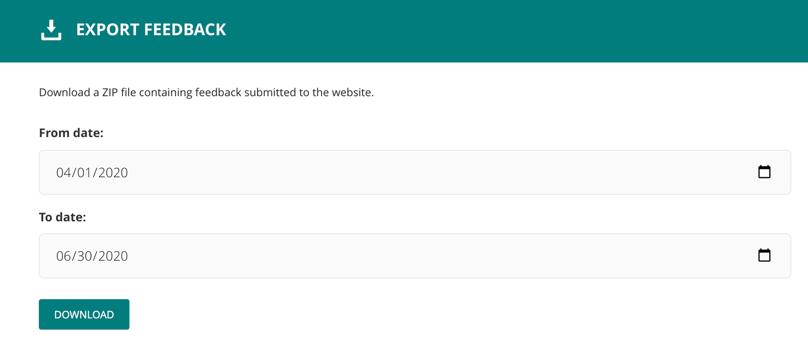

# Website feedback

Website pages can be configured to display forms that solicit feedback from
visitors, for example asking whether or not page information was useful and
accurate.

User-submitted feedback is stored in the Django database. There are several
ways to access and export this data.

## Exporting feedback using Wagtail

Users with appropriate permissions have access to an "Export feedback" tool
in Wagtail. This tool generates a ZIP file containing submitted feedback
between two user-specified dates.



Feedback is automatically grouped into three segments, each stored as a CSV:

- Feedback submitted on Ask CFPB pages (both English and Spanish)
- Feedback submitted on Buying a House pages
- Feedback submitted on all other website pages

In order to access this part of the Wagtail admin, users must be granted the
"Can export feedback from the Wagtail admin" permission. This can be enabled
or disabled for different Wagtail groups in the Groups area of the admin.

## Exporting feedback from the command line

For more control over what feedback to export, the
[`export_feedback`](https://github.com/cfpb/consumerfinance.gov/blob/main/cfgov/v1/management/commands/export_feedback.py)
Django management command can be used. This command generates a CSV file
containing feedback for a specified set of pages and/or dates.

To export all website feedback for all time, use this command:

```sh
cfgov/manage.py export_feedback --filename output.csv
```

(Alternatively, exclude the `--filename` parameter to send the output to the
console.)

To export feedback for a specific Wagtail page and its descendants, provide its
slug. Specified pages must have slugs that are unique across the website.

```sh
cfgov/manage.py export_feedback ask-cfpb --filename ask_cfpb.csv
```

Specify multiple slugs to export feedback for multiple pages:

```sh
cfgov/manage.py export_feedback ask-cfpb owning-a-home --filename ask_and_bah.csv
```

To invert the selection, and export feedback for all pages _except_ those
specified, use the `--exclude` parameter:

```sh
cfgov/manage.py export_feedback --exclude ask-cfpb --filename everything_except_ask.csv
```

To limit the exported feedback within a given date range, provide the
`--from-date` and/or the `--to-date` parameters. These parameters are
inclusive, meaning that feedback submitted on or between the dates is included
in the export.

```sh
cfgov/manage.py export_feedback --from-date 2019-01-01 --to-date 2019-12-31 --filename 2019.csv
```

## Querying feedback programmatically

For even greater control, feedback can be queried from a Python shell using the
[`Feedback`](https://github.com/cfpb/consumerfinance.gov/blob/main/cfgov/v1/models/feedback.py)
Django model.

This model includes a
[custom manager](https://docs.djangoproject.com/en/1.11/topics/db/managers/#custom-managers)
that exposes a `for_pages` method that can be used to efficiently query
feedback for one or more pages and all of their descendants:

```py
feedback = Feedback.objects.for_pages([page1, page2])
```

Like the management command, it can also be used to invert the selection:

```py
feedback = Feedback.objects.for_pages([page], exclude=True)
```

This method can also be combined in the usual way with other standard Django
queryset methods:

```py
feedback = Feedback.objects.for_pages([page]).filter(language='es')
```
