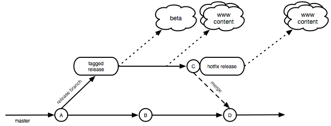
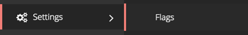
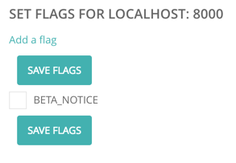

# Building and Deploying for cf.gov

This document summarizes the basic ideas of building and deploying content and applications within the cf.gov ecosystem.

### What’s new?

#### Guiding principles
- Reverse the sprawl of technologies and repositories left by the last 5 years of consumerfinance.gov development. 
- Reduce risk by integrating earlier and implementing a single release cadence for the entire site.
- We don’t deploy code to coincide with announcements, and events. 
- Prefer using and/or extending the CMS and it’s primitives (page types, atomic design elements, etc) over the creation of “apps” that own a particular URL space.

#### Benefits
- By centering most work on the cfgov-refresh, it becomes easier to understand what’s happening, easier to communicate about the state of the site, easier to develop on, and simpler to deploy.
- By working with the CMS, we empower editors to determine when a particular page or section goes live, and can provide a way to edit the incidental text on a page. 

#### Practical impacts
- Any new work that will appear on consumerfinance.gov should be built with Django, and (subject to guidelines below) live in the primary code repo for the site (cfgov-refresh). 
- If a particular page, section, or feature can not go live before a particular date or time, then it must be hidden with feature flags or controlled via the CMS. Simply merging code (or updating a dependency) must not result in such things being revealed.


### New build approach

**For projects being developed outside of cfgov-refresh**, the relationship with the project (and particularly the ‘build’ server) is changing. Under the old system, we maintained a separate ‘requirements’ file for build, content, and production. The ‘build’ requirements generally grabbed the master branch of the app, and we would pin a particular version for content and production.

What we want to do now is quite a bit different. These apps will be treated like any other python dependency (ie, always pinned to a particular version). The ‘build’ server will reflect the master branch of cfgov-refresh, but for all other projects will only reflect the current pinned version reflected in requirements.txt, and changing that version requires a pull request. We then move complete releases of the site through the QA and deployment process described below under “release cadence”

In short: if your code is being maintained outside of cfgov-refresh, you will need to provide your own ‘build’ environment and CI pipeline. We are working with the delivery team to make this less painful than it sounds.

### Setting up repos and codebases

All new code should start in the [cfgov-refresh repository](https://github.com/cfpb/cfgov-refresh) unless the following is true:

- It does not require integration with CMS
- It is not expected to match the look and feel of the larger site (in fact "very different" is preferable to "almost the same")
- It must be pip installable like any other dependency. 

If a project meets this criteria, it is important to note that while the app itself is not necessarily tied to the cf.gov platform’s release cadence, its dependencies are. Such projects must also maintain it's own continuous integration pipeline and build server.

For everything else, all code in the master branch is subject to a regular release cadence. Features that must go live on a certain date should be hidden by feature flags. Deployments should not be timed to coincide with announcements, press releases, speeches, or other events. The code should be already deployed and waiting for the feature to be turned on by a site manager. See “Feature Flags”.

Rather than using “classic” Django views added to urls.py, when feasible an app should provide singleton Wagtail Page. See “Wagtail Pages”.

### Decision Matrix

Product | Content Pages | APIs | HTML5 API Clients ("single page apps") | Traditional Web Apps 
------- | ------------- | ---- | -------------------------------------- | --------------------
What to build | Wagtail page types and templates | Django app using Django REST Framework | The API (if needed) and Wagtail page type and template to host the client | A standard models / forms / views-based Django app. Often calling internal/external APIs
Where does the code live | cfgov-refresh | cfgov-refresh (see exceptions) | cfgov-refresh | cfgov-refresh (see exceptions)
How to start | Extend our existing library of page types and molecules | create a django app in the "api's" namespace | Build the API first, then create a wagtail page to host the tool | Create a Django app at the top level of the repo. When feasible, consider providing Wagtail page-types instead of traditional views
How to ship | With release cycle | With release cycle | Consider getting APIs deployed well in advance | with release cycle | with release cycle
How to change | See below | With the release cycle | Use [API versioning](http://www.django-rest-framework.org/api-guide/versioning/) to avoid breaking existing code | See below | Generally with the release cycle. If using Wagtail, see guidelines below. If not, use feature flags to hide changes that must go live at a particular time/date.

### How to handle Wagtail changes

#### Minor visual updates to a page

- make the changes as part of the release cadence

#### Extensive visual changes to a page

- create a new template to reflect the new design
- edit the page type to allow for switching between old and new templates.
- on build and staging servers, feel free to switch back and forth between the designs

#### Visual and minor data model changes

- make the data model changes in such a way that doesn't break the current template
- follow the "extensive visual changes to a page" guidance above to make the visual changes

#### Major data model changes

- create a new page type, and the corresponding template
- Editors can then replace the old page with the new one, at will

### Front-end Resources ###

Front-end resources should conform to the [CFPB front-end guides](front-end-guide.md) and should use atomic elements, organisms, existing structure and convention. When applicable, front-end components should be added to Capital Framework using atomic design principles.

Projects that will be part of cfgov but live in their own repositories should:

- follow file-naming conventions for their front-end resources to avoid collisions (eg, project_name.js rather than main.js) OR follow resource folder structure conventions
- where possible, follow front-end guidelines/templates for new projects, including build processes and testing setup
- where necessary, follow a suggested approach for sharing resources (javascript/css) that are internal to cfgov-refresh

### Branching and merging

Branches should be named descriptively, preferably in some way that indicates whether they are short-lived feature branches or longer-lived development branches. Short-lived feature branches should be deleted once they are merged into master. 

All pull requests to merge into master must be reviewed by at least one member of the cf.gov platform team. The cf.gov platform team will ensure that these reviews happen in a timely manner. To ensure timely code reviews, please tag all PRs to master with @cfpb/cfgov-backends and @cfpb/cfgov-frontends as appropriate.

The cfgov-refresh repository makes use of automated testing and linting to ensure the quality, consistency, and readability of the codebase. All pull requests to master must pass all automated tests and must not reduce the code coverage of the codebase. It is the responsibility of the submitter to ensure that the tests pass.

Pull requests that are *not* to master must use GitHub labels in such a way that individuals who are responsible for reviewing those pull requests can easily find them. Pull requests that are works-in-progress must be clearly labeled as such.

Generally, teams working on cf.gov projects should create and collaborate on feature branches, with frequent merges back to master. Teams are responsible for governing their own branches and forks, these guidelines apply to master. 

### Release Cadence

cf.gov will be on a two week release cadence that will line up with the platform team’s sprint schedule. The release process is as follows:

- For each release, a new branch is created from the current master, representing the next minor release, e.g. 5.1. 
- A new release is tagged from that branch with a 0 patch number, e.g. 5.1.0.
- That release is deployed to beta.
- If any fixes are necessary before going to production, they are committed to the release branch, and back-merged to master. New "hotfix" releases are tagged from the branch with the appropriate patch number as needed to get urgent changes onto beta.
- The latest release tagged on the release branch is deployed to www and content.
- If any urgent changes are needed before the next release is deployed to www and content, they are treated as hotfixes to the production release branch. Hot-fixes are committed to the release branch, and increment the patch number. For example, the first hotfix of 5.1 will be 5.1.1.



#### Sample schedule

Monday | Tuesday | Wednesday | Thursday | Friday
------ | ------- | --------- | -------- | ------
| 5.1 branched, 5.1.0 released, deployed to beta | | Hotfix 5.1.1 committed, released, deployed to beta | |
5.1.1 deployed to www and content | | Hotfix 5.1.2 committed, released, deployed to www and content | | | |
| 5.2 branched, deployed to beta | | | | | |

### Deployment

Everything that is part of cfgov-refresh and its dependencies are deployed as part of the cf.gov deployment jobs. For needs that are outside of the standard deployment process (perhaps relating to regular data loading or manipulation), additional jobs will need to be created.

Projects that are independent of cfgov-refresh will need to provide their own deployment process, and all jobs they require. They will not be automatically included in the cf.gov deployment process, and will not be on the cf.gov release cadence. 

All new deployment jobs, jobs that run in addition to the cf.gov depoyment jobs, as well as independent jobs, must be implemented with Jenkins-as-code.

### Deployment QA

All code that gets merged into the cfgov-refresh master must have adequate tests, as appropriate for the nature of the code. 

This could potentially include unit tests, browser tests, and 508-compliance tests.

There should be no drop in test coverage for cfgov-refresh.

Regular releases of cf.gov on our release cadence are automated, presuming:

- All unit tests pass 
- All functional tests pass
- There is no reduction in test coverage from the last release tagging

### Current deployment process

The current cf.gov deployment process requires running the following individual Jenkins jobs manually, in the following order:

- cf.gov-beta-frontend-build, build with the tag name of the latest release, i.e. 3.5.2.
- cf.gov-fab-deploy-django, build with DEPLOY_ENV Staging
- cf.gov-fab-deploy-django, build with DEPLOY_ENV ***PRODUCTION***

The following teams and individuals have the necessary access to deploy cf.gov releases:

- Ross Karchner
- Scott Cranfill
- Will Barton
- Bill Higgins
- Serghei Gorobet
- The Software Delivery team

### Feature flags

Feature flags are stored in the Wagtail database and exposed in the Wagtail admin under “Settings”:



Here flags can added, enabled, or disabled:




The flag consists of a single string (by convention all uppercase, with underscores instead of whitespace). Flags are disabled by default, and checks for flags that do not exist will return False.

Once a flag has been created it can be checked in Python and Jinja2 templates using the functions flag_enabled and flag_disabled found in flags.template_functions and exposed to templates in v1. 

#### Python example

```python
from flags.template_functions import flag_enabled, flag_disabled

If flag_enabled('BETA_NOTICE'):
	print(“Beta notice banner will be displayed”)

If flag_disabled(‘BETA_NOTICE’):
	print(“Beta notice banner will not be displayed”)
```
	
Jinja2 example:

```

    <div class="m-global-banner">
I’m a beta banner.   
    </div>

```

Feature flags are implemented as a Django app in cfgov-refresh/cfgov/flags. 

#### Feature Flag Hygiene

Feature flags should be rare and ephemeral. Changes should be small and frequent, and not big-bang releases, and flags that are no longer used should be cleaned up and removed from code and the database.

### Wagtail pages vs. Django views

Rather than using “classic” Django views added to urls.py, when feasible an app should provide singleton Wagtail Page. This will allow site editors to drop that page anywhere in the site’s URL structure that they wish. A Wagtail Page subclass can do anything a Django view can [when overriding the serve method](http://docs.wagtail.io/en/v1.5.2/topics/pages.html#more-control-over-page-rendering).

```python
from django.http import HttpResponse
from wagtail.wagtailcore.models import Page,

class HelloWorldPage(CFGOVPage):
    def serve(self, request):
        return HttpResponse("Hello World")
```
		
By working with the Wagtail CMS, we also get some of the benefits of feature flags for free.
